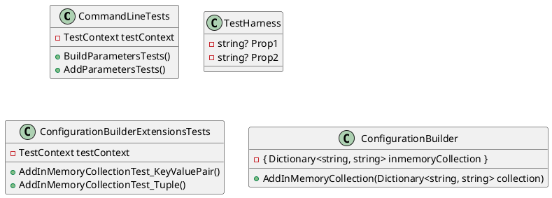

Here is the documentation for the provided source code:

**README.md**

## Introduction

This repository contains test code for the `Eliassen.Extensions.Configuration` NuGet package. The tests are written in C# and utilize the `Microsoft.VisualStudio.TestTools.UnitTesting` framework.

## Projects

### CommandLineTests

This project contains tests for the `CommandLine` class, which is used to build and add parameters to a configuration dictionary.

**Classes**

* `CommandLineTests`: Contains tests for the `CommandLine` class.
* `TestHarness`: A simple class used to test the `CommandLine` class.

**Methods**

* `BuildParametersTests`: Tests the `BuildParameters` method of the `CommandLine` class.
* `AddParametersTests`: Tests the `AddParameters` method of the `CommandLine` class.

### ConfigurationBuilderExtensionsTests

This project contains tests for the `ConfigurationBuilderExtensions` class, which provides methods for adding in-memory collections to a configuration builder.

**Classes**

* `ConfigurationBuilderExtensionsTests`: Contains tests for the `ConfigurationBuilderExtensions` class.

**Methods**

* `AddInMemoryCollectionTest_KeyValuePair`: Tests the `AddInMemoryCollection` method with a dictionary of key-value pairs.
* `AddInMemoryCollectionTest_Tuple`: Tests the `AddInMemoryCollection` method with a tuple of key-value pairs.

**Class Diagram**



**Sequence Diagram**

```plantuml
@startuml
sequenceDiagram
    participant CommandLineTests as\Tests
    participant ConfigurationBuilder as\ConfigBuilder
    Tests->>ConfigBuilder: Build()
    ConfigBuilder->>ConfigBuilder: AddInMemoryCollection(new Dictionary<string, string>{["Hello"]="world"})
    ConfigBuilder->>ConfigBuilder: Build()
    Tests->>ConfigBuilder: Get("Hello")
    ConfigBuilder->>Tests: "world"

    Tests->>ConfigBuilder: Build()
    ConfigBuilder->>ConfigBuilder: AddInMemoryCollection(("Hello", "world"))
    ConfigBuilder->>ConfigBuilder: Build()
    Tests->>ConfigBuilder: Get("Hello")
    ConfigBuilder->>Tests: "world"
@enduml
```

I hope this documentation helps to provide a clear understanding of the source code! Let me know if you have any questions or need further clarification.