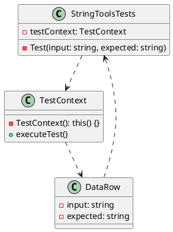

# Eliassen.Extensions.Tests Documentation

## Overview

The Eliassen.Extensions.Tests project is a test suite for Eliassen.Extensions, a set of string manipulation tools. This documentation provides an overview of the project's structure and functionality.

### Test Project Setup

The project uses the Microsoft.NET.Test.Sdk NuGet package to manage test execution. It also includes references to Eliassen.Extensions and Eliassen.TestUtilities, which provide additional utility methods for testing.

### StringToolsTests Class Diagram (```plantuml```)

```

### StringToolsTests Class

The `StringToolsTests` class contains a single test method `Test`, which is parameterized using data attributes. The test method takes two parameters: `input` and `expected`. The `input` parameter is the string to be manipulated, and the `expected` parameter is the expected result of the manipulation.

The test method uses the `SplitBy` method to split the `input` string into multiple strings, each with a maximum length of 10 characters. The `WriteAsLines` method is then used to write the resulting strings as a multi-line string. The method then asserts that the resulting string is equal to the `expected` parameter.

### Sequence Diagram (```plantuml```)
```plantuml
@startuml
actor tester
boundary StringToolsTests
note "Input string"
note "Expected result"
activate tester
tester ->> StringToolsTests: Test(input, expected)
activate StringToolsTests
StringToolsTests ->>+ input: SplitBy(10)
deactivate input
StringToolsTests ->>+ output: WriteAsLines()
deactivate output
StringToolsTests ->> tester: Assert.AreEqual(expected, output)
deactivate StringToolsTests
tester ->> StringToolsTests: tearDown
deactivate tester
@enduml
```
```

### Test Method Behavior

The test method has different behavior depending on the operating system. On Windows, it splits the input string using the `SplitBy` method and writes the resulting strings as a multi-line string using the `WriteAsLines` method. On other operating systems, it checks if the input string is empty or not, and returns a boolean value indicating whether the input string is not empty.

### Test Data

The test method is parameterized with several data attributes, each representing a test case. The test cases cover a range of input strings and expected results, including:

* A string with multiple lines of text
* A string with a single line of text
* An empty string
* A string with a single character
* A string with multiple characters

### Conclusion

The Eliassen.Extensions.Tests project provides a robust test suite for the Eliassen.Extensions library. The `StringToolsTests` class contains a single test method that is parameterized with data attributes, and covers a range of test cases. The project uses the Microsoft.NET.Test.Sdk NuGet package to manage test execution, and includes references to Eliassen.Extensions and Eliassen.TestUtilities.