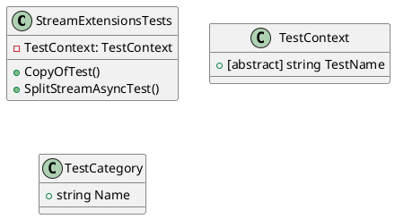

Here is the documentation for the `StreamExtensionsTests.cs` file, including a class diagram in PlantUML:

**Class Diagram**

**Class Documentation**

The `StreamExtensionsTests` class is a unit test class that tests the `StreamExtensions` class, which is part of the `Eliassen.Extensions.IO` namespace. This class contains two test methods: `CopyOfTest` and `SplitStreamAsyncTest`.

**CopyOfTest**

This test method tests the `CopyOf` method, which creates a copy of a Stream. The test creates two Memory Streams, `ms` and `ms2`, and uses the `CopyOf` method to create a copy of `ms`. The test asserts that the two streams are not equal, but have the same length.

**SplitStreamAsyncTest**

This test method tests the `SplitStreamAsync` method, which splits a Stream into chunks. The test creates a Memory Stream `ms` and uses the `SplitStreamAsync` method to split it into chunks. The test asserts that the number of chunks is equal to the expected value (3, which is set by the `DefaultChunkLength` property in the `StreamExtensions` class).

**TestContext**

The `TestContext` class is an abstract class that represents a test context. It contains a property `TestName` which is an abstract property that must be implemented by any derived class.

**TestCategory**

The `TestCategory` class represents a test category. It contains a property `Name` which represents the name of the category.

**Test Methods**

The `StreamExtensionsTests` class contains two test methods:

* `CopyOfTest`: Tests the `CopyOf` method.
* `SplitStreamAsyncTest`: Tests the `SplitStreamAsync` method.

These test methods are marked with the `[TestMethod]` attribute, which indicates that they are test methods. They are also marked with the `[TestCategory]` attribute, which specifies the category of the test (Unit).