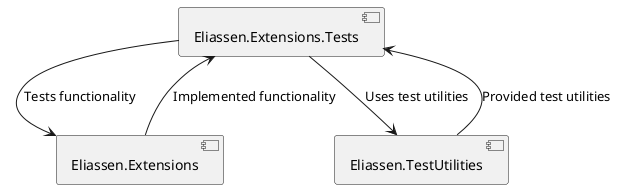

**README File**

**Overview**

The Eliassen.Extensions.Tests project contains a set of tests for the Eliassen.Extensions library. The tests are written using the Microsoft.VisualStudio.TestTools.UnitTesting framework and cover various aspects of the library's functionality.

**Technical Summary**

The test project uses the following design patterns and architectural patterns:

* **Test-Driven Development (TDD)**: The tests are written in a test-first approach to ensure that the library's functionality is thoroughly validated.
* **Mocking**: The tests use mocking to isolate dependencies and ensure that the tests are isolated and independent.

**Component Diagram**

Here is a component diagram using PlantUML:
```
