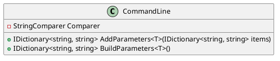
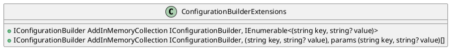

Here is the documentation for the source code in Markdown format:

# Eliassen.Extensions.Configuration

## CommandLine Class

The `CommandLine` class is a builder pattern implementation that helps in defining and adding configurable parameters.



The `AddParameters` method adds additional configurable parameters to a dictionary.

The `BuildParameters` method defines configurable parameters.

## ConfigurationBuilderExtensions Class

The `ConfigurationBuilderExtensions` class provides extension methods for adding in-memory collections to the `IConfigurationBuilder`.



The `AddInMemoryCollection` method adds an in-memory collection to the `IConfigurationBuilder` using the specified initial data.

### Methods

The `AddInMemoryCollection` method has two overloads:

* The first overload takes an `IConfigurationBuilder` and an `IEnumerable<(string key, string? value)>` as parameters, grouping the data by key and adding it to the in-memory collection.
* The second overload takes an `IConfigurationBuilder`, a `(string key, string? value)` tuple, and optional additional `(string key, string? value)` tuples as parameters, concatenating the data and adding it to the in-memory collection.

### Sequence Diagram

```plantuml
@startuml
participant "ConfigurationBuilder" as cb
participant "ConfigurationBuilderExtensions" as cbe
note "Initial data" as intData

cb ->> cbe : AddInMemoryCollection(intData)
alt is default
  cbe ->> cb : AddInMemoryCollection(initialData)
else is overload
  cbe ->> cb : AddInMemoryCollection(item, initialData...)
end
cb ->> cb : Build in-memory collection
@enduml
```

This sequence diagram shows the interaction between the `ConfigurationBuilder` and the `ConfigurationBuilderExtensions` classes when adding an in-memory collection using the `AddInMemoryCollection` method.