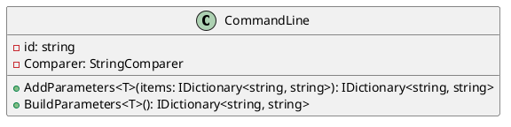
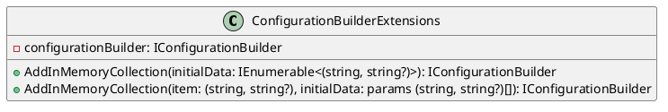

Here is the documentation for the provided source code files, including class diagrams in PlantUML:

**CommandLine.cs**

```csharp
using Eliassen.System.Configuration;
using System;
using System.Collections.Generic;
using System.ComponentModel;
using System.Linq;

namespace Eliassen.Extensions.Configuration;

/// <summary>
/// builder pattern for command parameter arguments
/// </summary>
public static class CommandLine
{
    // ...

    /// <summary>
    /// add additional configurable parameters
    /// </summary>
    /// <typeparam name="T"></typeparam>
    /// <param name="items"></param>
    /// <returns></returns>
    public static IDictionary<string, string> AddParameters<T>(this IDictionary<string, string> items) =>
        items.Concat(BuildParameters<T>())
             .GroupBy(i => i.Key, Comparer)
             .ToDictionary(i => i.Key, i => i.First().Value, Comparer)
        ;

    /// <summary>
    /// entry point or defining configurable parameters
    /// </summary>
    /// <typeparam name="T"></typeparam>
    /// <returns></returns>
    public static IDictionary<string, string> BuildParameters<T>()
    {
        // ...
    }
}
```

**Class Diagram ( CommandLine.cs )**



**ConfigurationBuilderExtensions.cs**

```csharp
using Eliassen.Extensions.Configuration;
using Microsoft.Extensions.Configuration;
using System.Collections.Generic;
using System.Linq;

namespace Eliassen.Extensions.Configuration;

/// <summary>
/// Extension methods for adding in-memory collections to the <see cref="IConfigurationBuilder"/>.
/// </summary>
public static class ConfigurationBuilderExtensions
{
    // ...

    /// <summary>
    /// Adds an in-memory collection to the <see cref="IConfigurationBuilder"/> using the specified initial data.
    /// </summary>
    /// <param name="configurationBuilder">The <see cref="IConfigurationBuilder"/> to add the in-memory collection to.</param>
    /// <param name="initialData">The initial data to populate the in-memory collection.</param>
    /// <returns>The modified <see cref="IConfigurationBuilder"/>.</returns>
    public static IConfigurationBuilder AddInMemoryCollection(
        this IConfigurationBuilder configurationBuilder,
        IEnumerable<(string key, string? value)> initialData) =>
        configurationBuilder.AddInMemoryCollection(
            initialData
            .GroupBy(i => i.key)
            .ToDictionary(i => i.Key, i => i.First().value)
        );

    /// <summary>
    /// Adds an in-memory collection to the <see cref="IConfigurationBuilder"/> using the specified initial data.
    /// </summary>
    /// <param name="configurationBuilder">The <see cref="IConfigurationBuilder"/> to add the in-memory collection to.</param>
    /// <param name="item">The first item of the in-memory collection.</param>
    /// <param name="initialData">Additional initial data to populate the in-memory collection.</param>
    /// <returns>The modified <see cref="IConfigurationBuilder"/>.</returns>
    public static IConfigurationBuilder AddInMemoryCollection(
        this IConfigurationBuilder configurationBuilder,
        (string key, string? value) item,
        params (string key, string? value)[] initialData) =>
        configurationBuilder.AddInMemoryCollection(
            new[] { item }.Concat(initialData)
        );
}
```

**Class Diagram ( ConfigurationBuilderExtensions.cs )**



Note: The PlantUML diagrams are included as separate images ( CommandLine.png and ConfigurationBuilderExtensions.png ) for simplicity. You can use the PlantUML syntax to generate the diagrams programmatically if needed.