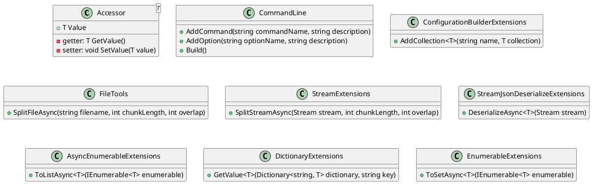

**Eliassen.Extensions Documentation**

### Overview

The Eliassen.Extensions namespace provides a collection of extension methods and utility classes for common tasks such as accessing values, configuration, file operations, stream manipulation, reflection, and string manipulation.

### Key Classes and Extensions

* **Accessor<T>**: Represents an accessor for a value of type T, providing a property to get or set the associated value.
* **CommandLine**: Provides a builder pattern for command parameter arguments, with methods for adding and building configurable parameters.
* **ConfigurationBuilderExtensions**: Extension methods for adding in-memory collections to the IConfigurationBuilder, allowing the addition of initial data.
* **FileTools**: Provides methods for working with files, including asynchronous splitting of files into chunks.
* **StreamExtensions**: Provides methods for working with streams, including creating an in-memory copy of a stream and splitting a stream into chunks.
* **StreamJsonDeserializeExtensions**: Extension methods for deserializing JSON streams using System.Text.Json.
* **StreamXmlDeserializeExtensions**: Extension methods for deserializing XML streams using System.Xml.
* **AsyncEnumerableExtensions**: Extensions to add async support to existing IEnumerable<T>, including methods for converting async enumerable sequences to lists and sets.
* **DictionaryExtensions**: Reusable extensions for generic dictionaries, including methods for getting values with a custom comparer and changing the dictionary comparer.
* **EnumerableExtensions**: Provides extension methods for asynchronous enumerables, such as converting async enumerable sequences to sets.
* **ReflectionExtensions**: Extensions for reflection and common patterns, including methods for getting method parameters, attributes, and static or instance methods.
* **ResourceExtensions**: Extension methods for working with embedded resources, including methods for getting resource streams and content as strings.
* **ServiceCollectionExtensions**: Suggested IOC configurations, including methods for registering accessor types and getting singleton instances from the IOC container.
* **StringTools**: Provides utility methods for string manipulation, such as splitting strings into lines and concatenating lines with newline separators.

### Getting Started

The Eliassen.Extensions namespace offers a wide range of utility classes and extension methods to streamline common development tasks. Simply include the namespace in your project and start using the provided classes and extensions in your code.

### Example Usage

```csharp
// Example of using StreamExtensions to split a file into chunks
var filename = "example.txt";
var chunkLength = 1024;
var overlap = 128;
await using var fileStream = File.OpenRead(filename);
await foreach (var chunk in fileStream.SplitStreamAsync(chunkLength, overlap))
{
    // Process each chunk asynchronously
}

// Example of using ReflectionExtensions to get method parameters
var methodInfo = typeof(MyClass).GetMethod("MyMethod");
var parameters = methodInfo.GetParametersTypes();

// Example of using ServiceCollectionExtensions to register accessor types
services.AddAccessor<MyClass>();

// Example of using StringTools to split a string into lines
var input = "Lorem ipsum dolor sit amet, consectetur adipiscing elit.";
var lines = input.SplitBy(20); // Split into lines of max 20 characters
```

### Diagrams

**Component Model**


**Sequence Diagram**
```plantuml
@startuml
participant "Client"
participant "Accessor"
participant "CommandLine"
participant "ConfigurationBuilder"
participant "FileTools"
participant "StreamExtensions"
participant "StreamJsonDeserializeExtensions"
participant "AsyncEnumerableExtensions"
participant "DictionaryExtensions"
participant "EnumerableExtensions"

note "get settings from configuration"
Client ->> CommandLine: GetSettings()
CommandLine ->> ConfigurationBuilder: GetSettings()
ConfigurationBuilder ->> Accessor: GetSettings()
Accessor ->> Client: Settings

note "get value from accessor"
Client ->> Accessor: GetValue(T)
Accessor ->> Client: Value

note "split file into chunks"
Client ->> FileTools: SplitFileAsync(filename, chunkLength, overlap)
FileTools ->> StreamExtensions: SplitStreamAsync(stream, chunkLength, overlap)
StreamExtensions ->> Client: Chunk

note "deserialize chunk"
Client ->> StreamJsonDeserializeExtensions: DeserializeAsync<T>(stream)
StreamJsonDeserializeExtensions ->> Client: Deserialized