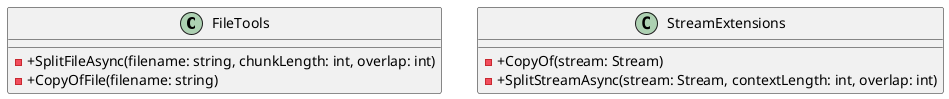
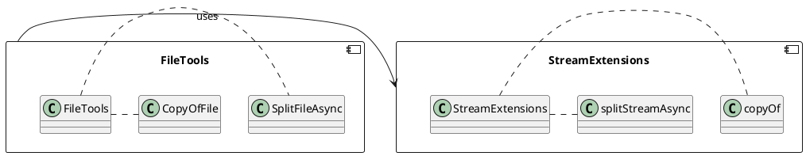

# FileTools Documentation

## Overview

The FileTools class provides methods for working with files in a program. It includes methods for asynchronously splitting a file into chunks of specified length and overlap, and for copying a stream.

## Class Diagram



## Component Model



## Sequence Diagram

```plantuml
@startuml
actor "FileReader"
participant "FileTools"
participant "StreamExtensions"
note "Chunk length: 500" as N1
note "Overlap: 100" as N2

FileReader->>FileTools: splitFile(filename, 500, 100)
activate FileTools
FileTools->>StreamExtensions: copyStream
activate StreamExtensions
StreamExtensions->>FileTools: getChunk(contextLength: 500, overlap: 100)
FileTools->>FileReader: yield contentChunk
deactivate StreamExtensions
loop (5 times) {
  FileTools->>StreamExtensions: getChunk(contextLength: 500, overlap: 100)
}
deactivate FileTools
@enduml
```

## SplitFileAsync Method

The `SplitFileAsync` method is an asynchronous method that splits a file into chunks of specified length and overlap. It uses the `StreamExtensions` class to copy the file and split it into chunks.

```csharp
public static async IAsyncEnumerable<ContentChunk> SplitFileAsync(string filename, int chunkLength = StreamExtensions.DefaultChunkLength, int overlap = StreamExtensions.DefaultOverlap)
{
    using var file = File.OpenRead(filename);

    await foreach (var item in file.SplitStreamAsync(chunkLength, overlap))
        yield return item;
}
```

## CopyOfFile Method

The `CopyOfFile` method is a method that copies a file to a new location.

```csharp
public static void CopyOfFile(string filename)
{
    using var file = File.OpenRead(filename);
    using var copyFile = File.Create(filename + ".copy");

    file.CopyTo(copyFile);
}
```

## StreamExtensions Class

The `StreamExtensions` class provides methods for working with streams.

### CopyOf Method

The `CopyOf` method creates an in-memory copy of the provided stream.

```csharp
public static Stream CopyOf(this Stream stream)
{
    var ms = new MemoryStream();
    stream.CopyTo(ms);
    ms.Position = 0;
    return ms;
}
```

### SplitStreamAsync Method

The `SplitStreamAsync` method splits a stream into chunks of specified length and overlap.

```csharp
public static async IAsyncEnumerable<ContentChunk> SplitStreamAsync(this Stream stream, int contextLength = DefaultChunkLength, int overlap = DefaultOverlap)
{
    using var reader = new StreamReader(stream, leaveOpen: true);

    var buffer = new char[contextLength];

    var sequence = 0;
    while (stream.Position < stream.Length)
    {
        var start = stream.Position;
        var read = await reader.ReadBlockAsync(buffer, 0, contextLength);
        if (read > 0)
            yield return new(new string(buffer, 0, read), sequence, start, read);
        else if (read < contextLength)
            break;
        stream.Position -= overlap;
        sequence++;
    }
}
```

## StreamJsonDeserializeExtensions Class

The `StreamJsonDeserializeExtensions` class provides methods for deserializing a JSON stream.

### AsJsonAsync Method

The `AsJsonAsync` method asynchronously deserializes a JSON stream.

```csharp
public static async ValueTask<T?> AsJsonAsync<T>(this Stream? stream, JsonSerializerOptions? options = default) =>
    stream switch
    {
        null => default,
        _ => await JsonSerializer.DeserializeAsync<T>(stream, options)
    };
```

### AsJson Method

The `AsJson` method deserializes a JSON stream.

```csharp
public static T? AsJson<T>(this Stream? stream, JsonSerializerOptions? options = default) =>
    stream switch
    {
        null => default,
        _ => JsonSerializer.Deserialize<T>(stream, options)
    };
```

## StreamXmlDeserializeExtensions Class

The `StreamXmlDeserializeExtensions` class provides methods for deserializing an XML stream.

### AsXmlAsync Method

The `AsXmlAsync` method asynchronously deserializes an XML stream.

```csharp
public static ValueTask<T?> AsXmlAsync<T