**README File**

This project provides a set of extension methods for working with files and streams in .NET. The extensions provide functionality for splitting files into chunks, creating in-memory copies of streams, and deserializing JSON and XML streams into .NET objects.

**Functional Summary**

The **FileTools** class provides a method for splitting a file into chunks of specified length and overlap, allowing for efficient processing of large files. The **StreamExtensions** class provides a method for creating an in-memory copy of a stream and a method for splitting a stream into chunks. The **StreamJsonDeserializeExtensions** and **StreamXmlDeserializeExtensions** classes provide a set of extension methods for deserializing JSON and XML streams into .NET objects.

**Technical Summary**

The project uses the following design patterns and architectural patterns:

1. **Extension Methods**: The project uses extension methods to provide additional functionality to existing classes, such as `Stream` and `File`.
2. **Observer Pattern**: The **SplitFileAsync** method uses the observer pattern to yield back a sequence of `ContentChunk` objects representing the chunks of the file.
3. **Decorator Pattern**: The **CopyOf** method uses the decorator pattern to create an in-memory copy of the stream.

**Component Diagram**

Here is the component diagram for the project, generated using PlantUML:

```plantuml
@startuml
component "FileTools" {
  class FileTools {
    +SplitFileAsync(filename: string, chunkLength: int, overlap: int): IAsyncEnumerable<ContentChunk>
  }
}

component "StreamExtensions" {
  class StreamExtensions {
    +CopyOf(stream: Stream): Stream
    +SplitStreamAsync(stream: Stream, chunkLength: int, overlap: int): IAsyncEnumerable<ContentChunk>
  }
}

component "StreamJsonDeserializeExtensions" {
  class StreamJsonDeserializeExtensions {
    +AsJsonAsync<T>(stream: Stream, options: JsonSerializerOptions? = null): ValueTask<T?>
    +AsJson<T>(stream: Stream, options: JsonSerializerOptions? = null): T?
  }
}

component "StreamXmlDeserializeExtensions" {
  class StreamXmlDeserializeExtensions {
    +AsXmlAsync<T>(stream: Stream, extraTypes: Type[]): ValueTask<T?>
    +AsXml<T>(stream: Stream, extraTypes: Type[]): T?
  }
}

stream -> stream : Copy
stream -> stream : Split
stream -> jsonStream : DeserializeJson
stream -> xmlStream : DeserializeXml
@enduml
```

This diagram shows the relationships between the various components and classes in the project, including the extension methods and the deserialization methods.