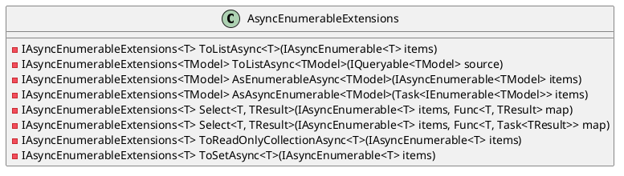
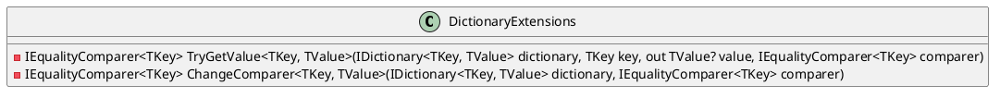

Here is a partial documentation for the provided source code files:

**AsyncEnumerableExtensions.cs**

This class provides extensions to add asynchronous support to existing `IEnumerable<T>`.

| Method | Description |
| --- | --- |
| `ToListAsync<T>` | Converts an asynchronous enumerable sequence to a list asynchronously. |
| `ToListAsync<TModel>` | Processes an `IQueryable<TModel>` to a list asynchronously. |
| `AsEnumerableAsync<TModel>` | Converts an `IAsyncEnumerable<TModel>` to a task that returns an enumerable sequence. |
| `AsAsyncEnumerable<TModel>` | Converts a task that returns an enumerable sequence to an `IAsyncEnumerable<TModel>`. |
| `Select<T, TResult>` | Projects each element of the source asynchronous enumerable sequence into a new form asynchronously. |
| `ToReadOnlyCollectionAsync<T>` | Converts an asynchronous enumerable sequence to a read-only collection asynchronously. |
| `ToSetAsync<T>` | Converts an asynchronous enumerable sequence to a set asynchronously (obsolete). |

**Class Diagram (in PlantUML)**

**DictionaryExtensions.cs**

This class provides reusable extensions for generic dictionaries.

| Method | Description |
| --- | --- |
| `TryGetValue<TKey, TValue>` | Extends the `TryGetValue` method to allow using a different `IEqualityComparer<TKey>`. |
| `ChangeComparer<TKey, TValue>` | Rebuilds a dictionary to use a different `IEqualityComparer<TKey>`. |

**Class Diagram (in PlantUML)**

Please note that the class diagrams are simplified and do not include all the necessary details (e.g., method parameters, return types, etc.). They are intended to provide a high-level overview of the classes and their relationships.