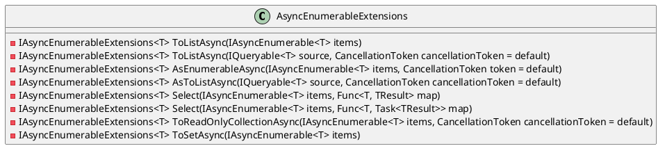
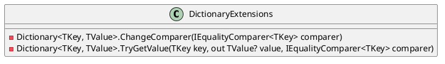

Here is the documentation for the source code in Markdown format:

# AsyncEnumerableExtensions

## Overview

The `AsyncEnumerableExtensions` class provides various extensions to add async support to existing IEnumerable{T} APIs. These extensions make it easier to work with asynchronous enumerable sequences, allowing developers to write more efficient and scalable code.

## Class Diagram


## AsEnumerableAsync

### Overview

The `AsEnumerableAsync` method converts an `IAsyncEnumerable<T>` to an `IEnumerable<T>` asynchronously.

### Parameters

* `items`: The `IAsyncEnumerable<T>` to convert.
* `token`: The cancellation token to use for the conversion.

### Returns

* An `IEnumerable<T>` containing the elements of the input `IAsyncEnumerable<T>`.

[Sequence Diagram for AsEnumerableAsync]
```plantuml
@startuml
sequenceDiagram
    participant CL as Caller
    participant AE as AsyncEnumerable
    participant IE as Enumerable

    CL->>AE: AsEnumerableAsync(items, token)
    AE->>IE: FOREACH item in items
    IE->>CL: item
    CL->>AE: if token.IsCancellationRequested
    AE->>CL: BREAK
    AE->>CL: FOREACH item in items
    AE->>CL: yield return item
    CL->>AE: foreach item in items
    AE->>IE: FOREACH item in items
    IE->>CL: item
    CL->>AE: if token.IsCancellationRequested
    AE->>CL: BREAK
    AE->>CL: FOREACH item in items
    AE->>CL: yield return item
    CL->>AE: foreach item in items

@enduml
```

## Select

### Overview

The `Select` method projects each element of the input `IAsyncEnumerable<T>` into a new form asynchronously.

### Parameters

* `items`: The `IAsyncEnumerable<T>` to project.
* `map`: The transformation function to apply to each element.

### Returns

* An `IAsyncEnumerable<TResult>` containing the projected elements.

[Sequence Diagram for Select]
```plantuml
@startuml
sequenceDiagram
    participant CL as Caller
    participant AE as AsyncEnumerable
    participant IE as Enumerable

    CL->>AE: Select(items, map)
    AE->>IE: FOREACH item in items
    IE->>CL: map(item)
    CL->>AE: yield return map(item)
    AE->>CL: foreach item in items

@enduml
```

## ToListAsync

### Overview

The `ToListAsync` method converts an `IAsyncEnumerable<T>` to a list asynchronously.

### Parameters

* `items`: The `IAsyncEnumerable<T>` to convert.

### Returns

* A `List<T>` containing the elements of the input `IAsyncEnumerable<T>`.

## DictionaryExtensions

### Overview

The `DictionaryExtensions` class provides various extensions for generic dictionaries.

### Class Diagram


## ChangeComparer

### Overview

The `ChangeComparer` method rebuilds a dictionary to use a different `IEqualityComparer{TKey}`.

### Parameters

* `dictionary`: The dictionary to rebuild.
* `comparer`: The new `IEqualityComparer{TKey>` to use.

### Returns

* A new dictionary with the same elements as the input dictionary, but using the new comparer.

## TryGetValue

### Overview

The `TryGetValue` method extends the `IDictionary<TKey, TValue>.TryGetValue` method to allow for using a different `IEqualityComparer{TKey}`.

### Parameters

* `dictionary`: The dictionary to use.
* `key`: The key to look up.
* `value`: The output parameter to receive the value.
* `comparer`: The comparer to use for