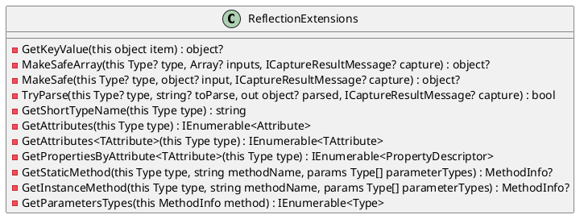
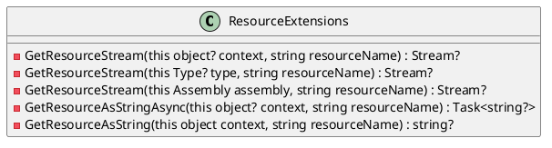

Here is the documentation for the provided source code files, including class diagrams in PlantUML:

**ReflectionExtensions.cs**

This class provides various extension methods for reflection and common patterns.

**Class Diagram:**

**Method Descriptions:**

* `GetKeyValue(this object item)`: Returns a lookup key value for the provided entity.
* `MakeSafeArray(this Type? type, Array? inputs, ICaptureResultMessage? capture)`: Safely creates a new array for a given element type.
* `MakeSafe(this Type? type, object? input, ICaptureResultMessage? capture)`: Makes an attempt to convert an input to a target type as best as possible.
* `TryParse(this Type? type, string? toParse, out object? parsed, ICaptureResultMessage? capture)`: Tries to parse a string to an object using the best possible match for the provided type.
* `GetShortTypeName(this Type type)`: Returns the type name with full namespace and assembly name.
* `GetAttributes(this Type type)`: Returns all attributes for a type.
* `GetAttributes<TAttribute>(this Type type)`: Returns all attributes of a specific type.
* `GetPropertiesByAttribute<TAttribute>(this Type type)`: Returns all properties with a specified attribute.
* `GetStaticMethod(this Type type, string methodName, params Type[] parameterTypes)`: Gets a static method.
* `GetInstanceMethod(this Type type, string methodName, params Type[] parameterTypes)`: Gets an instance method.
* `GetParametersTypes(this MethodInfo method)`: Returns the parameters types for a method.

**ResourceExtensions.cs**

This class provides various extension methods for embedded resources.

**Class Diagram:**

**Method Descriptions:**

* `GetResourceStream(this object? context, string resourceName)`: Looks up a resource stream based on the filename relative to the scope of the context.
* `GetResourceStream(this Type? type, string resourceName)`: Looks up a resource stream based on the filename relative to the scope of a type.
* `GetResourceStream(this Assembly assembly, string resourceName)`: Looks up a resource stream based on the filename relative to the scope of an assembly.
* `GetResourceAsStringAsync(this object? context, string resourceName)`: Looks up the content of a resource as a string.
* `GetResourceAsString(this object context, string resourceName)`: Looks up the content of a resource as a string.

Note: The PlantUML diagrams are generated based on the public method signatures and do not include any implementation details.