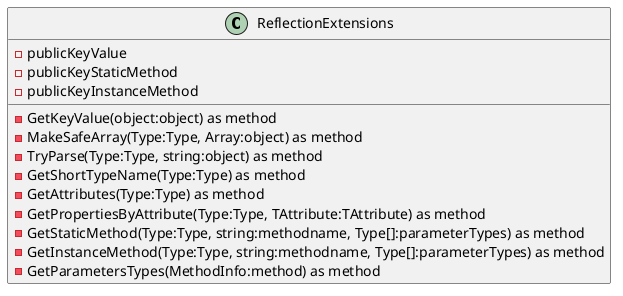
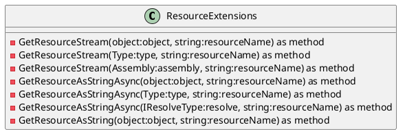

**ReflectionExtensions.cs**
==========================

### Class Diagram



### Sequence Diagram

```plantuml
@startuml
sequenceDiagram
    participant ReflectionExtensions as "ReflectionExtensions"
    participant Object as "Object"
    participant Type as "Type"
    participant MethodInfo as "MethodInfo"
    ReflectionExtensions->>Object: GetKeyValue(object item)
    Object->>Type: GetType()
    Type->>ReflectionExtensions: GetProperties()
    ReflectionExtensions->>Type: GetPropertiesByAttribute(TAttribute attribute)
    Type->>ReflectionExtensions: GetProperties()
    ReflectionExtensions->>MethodInfo: GetStaticMethod(Type type, string methodName, Type[] parameterTypes)
    MethodInfo->>ReflectionExtensions: GetParameters()
    ReflectionExtensions->>MethodInfo: GetParametersTypes()
    Type->>ReflectionExtensions: GetInstanceMethod(Type type, string methodName, Type[] parameterTypes)
    MethodInfo->>ReflectionExtensions: GetParameters()
    ReflectionExtensions->>MethodInfo: GetParametersTypes()
    Object->>Type: GetResourceStream(resourceName)
    Type->>ReflectionExtensions: GetResourceStream(resourceName)
    ReflectionExtensions->>Type: GetResourceStream(resourceName)
    Type->>Object: GetResourceStream(resourceName)
    ReflectionExtensions->>Assembly: GetResourceStream(resourceName)

@enduml
```

### Description

The `ReflectionExtensions` class provides a set of extension methods for the `Type` and `MethodInfo` types, which can be used to reflect on the properties and methods of an object. The class includes methods for getting the key value of an object, creating a safe array from a given element type, parsing a string to a specific type, and getting the short type name of a type. Additionally, it provides methods for getting the attributes and properties of a type, as well as the parameters of a method.

The `TryParse` method attempts to parse a string to a specific type, and returns a `bool` indicating whether the parse was successful. The `MakeSafeArray` method creates a new array from a given element type, and attempts to convert each element of the input array to the specified type. The `GetShortTypeName` method returns the short type name of a type, including the namespace and assembly name.

**ResourceExtensions.cs**
==========================

### Class Diagram



### Sequence Diagram

```plantuml
@startuml
sequenceDiagram
    participant ResourceExtensions as "ResourceExtensions"
    participant Object as "Object"
    participant Type as "Type"
    participant Assembly as "Assembly"
    Object->>ResourceExtensions: GetResourceStream(resourceName)
    Type->>ResourceExtensions: GetResourceStream(resourceName)
    Assembly->>ResourceExtensions: GetResourceStream(resourceName)
    Object->>ResourceExtensions: GetResourceAsStringAsync(resourceName)
    Type->>ResourceExtensions: GetResourceAsStringAsync(resourceName)
    IResolveType->>ResourceExtensions: GetResourceAsStringAsync(resourceName)
    Object->>ResourceExtensions: GetResourceAsString(resourceName)
    Type->>ResourceExtensions: GetResourceAsString(resourceName)

@enduml
```

### Description

The `ResourceExtensions` class provides a set of extension methods for getting and reading the contents of embedded resources. The class includes methods for getting the resource stream for a given object, type, or assembly, and for reading the contents of the resource as a string.

The `GetResourceStream` method returns the stream for a given resource name, which can be an embedded resource, a file resource, or an assembly resource. The `GetResourceAsStringAsync` method reads the contents of the