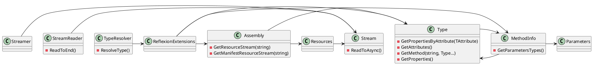

**Readme File**

**Summary**

The `Eliassen.Extensions.Reflection` namespace contains a set of extension methods for reflection and common patterns. It provides functionality for working with types, properties, methods, and resources in a program. This namespace is designed to be used in conjunction with the `Eliassen.System.ComponentModel` and `Eliassen.System.ResponseModel` namespaces.

**Technical Summary**

The `ReflectionExtensions` class uses various design patterns and architectural patterns to implement its functionality. Specifically, it employs the following:

* **Factory Pattern**: The `MakeSafe` method uses a factory pattern to create a new array of a given type.
* **Strategy Pattern**: The `MakeSafe` method uses a strategy pattern to decide which conversion method to use for converting a value to a target type.
* **Decorator Pattern**: The `GetAttributes` method uses a decorator pattern to extend the behavior of the `TypeDescriptor.GetAttributes` method.
* **Strategy Pattern**: The `GetPropertiesByAttribute` method uses a strategy pattern to decide which property to return based on the attributes applied.

**Component Diagram**

This component diagram shows the relationships between the classes and interfaces in the `Eliassen.Extensions.Reflection` namespace. It highlights the key concepts, such as types, methods, assemblies, resources, and streams, and shows how they interact with each other.