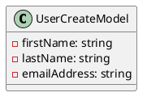
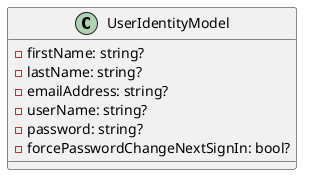

# Eliassen Identity Documentation

## Overview

The Eliassen Identity library provides a set of models for representing user identity information and creating new users in a Microsoft B2C Identity environment.

## Models

### UserCreateModel




```UserCreateModel.cs
namespace Eliassen.Identity;

/// <summary>
/// Represents a model for creating a user in Microsoft B2C Identity.
/// </summary>
public record UserCreateModel
{
    /// <summary>
    /// Gets or sets the first name of the user.
    /// </summary>
    public required string FirstName { get; set; }

    /// <summary>
    /// Gets or sets the last name of the user.
    /// </summary>
    public required string LastName { get; set; }

    /// <summary>
    /// Gets or sets the email address of the user.
    /// </summary>
    public required string EmailAddress { get; set; }
}
```

### UserIdentityModel




```UserIdentityModel.cs
namespace Eliassen.Identity;

/// <summary>
/// Represents a model for user identity information.
/// </summary>
public record UserIdentityModel
{
    /// <summary>
    /// Gets or sets the first name of the user.
    /// </summary>
    public string? FirstName { get; set; }

    /// <summary>
    /// Gets or sets the last name of the user.
    /// </summary>
    public string? LastName { get; set; }

    /// <summary>
    /// Gets or sets the email address of the user.
    /// </summary>
    public string? EmailAddress { get; set; }

    /// <summary>
    /// Gets or sets the username of the user.
    /// </summary>
    public string? UserName { get; set; }

    /// <summary>
    /// Gets or sets the password of the user.
    /// </summary>
    public string? Password { get; set; }

    /// <summary>
    /// Gets or sets a value indicating whether the user should be forced to change their password at the next sign-in.
    /// </summary>
    public bool? ForcePasswordChangeNextSignIn { get; set; }
}
```

## Sequence Diagram

```plantuml
@startuml
sequenceDiagram
    participant User as "User"
    participant EliassenIdentity as "EliassenIdentity"
    note "Create a new user" as "CreateUser"

    User->>EliassenIdentity: CreateUserUserCreateModel
    EliassenIdentity->>User: ConfirmCreation
    note "User created successfully"

    alt forcePasswordChangeNextSignIn == true
        note "User must change password at next sign-in"
    end

    User->>EliassenIdentity: Authenticate(string, string)
    EliassenIdentity->>User: AuthenticationResult
    note "User authenticated successfully"
@enduml
```

This sequence diagram illustrates the interaction between the user and the Eliassen Identity library when creating a new user and authenticating with the system.