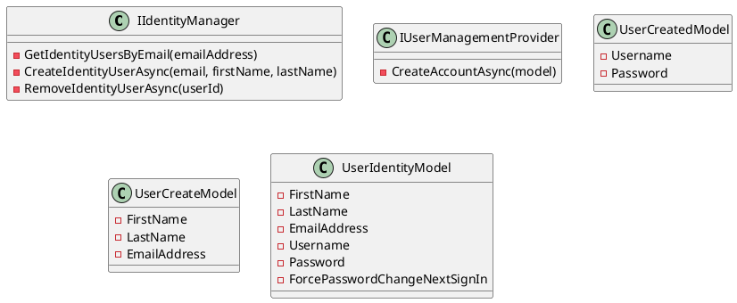

**Eliassen.Identity.Abstractions**

Eliassen.Identity.Abstractions is a set of abstractions and models aimed at facilitating user identity management. Here's a breakdown of its components:

### Class Diagram



### Component Model

```plantuml
@startuml
component Eliassen.Identity {
  interface IIdentityManager
  interface IUserManagementProvider
  model UserCreatedModel
  model UserCreateModel
  model UserIdentityModel
}
@enduml
```

### Sequence Diagram

```plantuml
@startuml
actor user
participant "Eliassen.Identity" as eid
note over eid, "Identity Manager" as manager
note over user, "User" as user

sequenceDiagram
    user->>eid: GetIdentityUsersByEmail(emailAddress)
    eid->>user: List of UserIdentityModel
    note "User is authenticated"

    user->>eid: CreateIdentityUserAsync(email, firstName, lastName)
    eid->>user: UserCreatedModel
    note "New user is created"

    user->>eid: RemoveIdentityUserAsync(userId)
    eid->>user: bool
    note "User is removed"
@enduml
```

**IIdentityManager Interface**

Represents an identity manager for managing user identities.

### Methods

* **GetIdentityUsersByEmail(emailAddress)**: Retrieves a list of user identity models based on the specified email address.
* **CreateIdentityUserAsync(email, firstName, lastName)**: Creates a new identity user asynchronously with the specified details.
* **RemoveIdentityUserAsync(userId)**: Removes an identity user asynchronously based on the specified object ID.

**IUserManagementProvider Interface**

Provides methods for managing user accounts.

### Methods

* **CreateAccountAsync(model)**: Creates a user account asynchronously based on the provided model.

**UserCreatedModel Class**

Represents the model for a user created as a result of account creation.

### Properties

* **Username**: Gets or sets the username associated with the created user.
* **Password**: Gets or sets the password associated with the created user.

**UserCreateModel Class**

Represents a model for creating a user in Microsoft B2C Identity.

### Properties

* **FirstName**: Gets or sets the first name of the user.
* **LastName**: Gets or sets the last name of the user.
* **EmailAddress**: Gets or sets the email address of the user.

**UserIdentityModel Class**

Represents a model for user identity information.

### Properties

* **FirstName**: Gets or sets the first name of the user.
* **LastName**: Gets or sets the last name of the user.
* **EmailAddress**: Gets or sets the email address of the user.
* **Username**: Gets or sets the username of the user.
* **Password**: Gets or sets the password of the user.
* **ForcePasswordChangeNextSignIn**: Gets or sets a value indicating whether the user should be forced to change their password at the next sign-in.