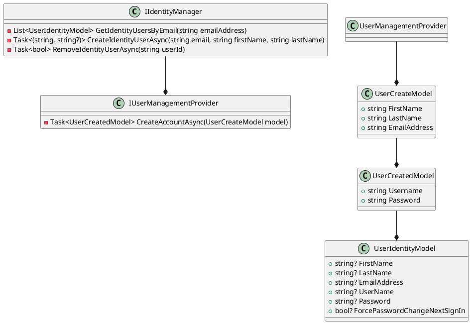

Here is the documentation for the provided source code files:

**Class Diagram in PlantUML:**

**IIdentityManager Class:**
```csharp
/// <summary>
/// Represents an identity manager for managing user identities.
/// </summary>
public interface IIdentityManager
{
    /// <summary>
    /// Retrieves a list of user identity models based on the specified email address.
    /// </summary>
    /// <param name="emailAddress">The email address to search for.</param>
    /// <returns>A task that represents the asynchronous operation. The task result contains the list of user identity models or null if no users are found.</returns>
    Task<List<UserIdentityModel>?> GetIdentityUsersByEmail(string emailAddress);

    /// <summary>
    /// Creates a new identity user asynchronously with the specified details.
    /// </summary>
    /// <param name="email">The email address of the user.</param>
    /// <param name="firstName">The first name of the user.</param>
    /// <param name="lastName">The last name of the user.</param>
    /// <returns>A task that represents the asynchronous operation. The task result contains the object ID and an optional password for the created user.</returns>
    Task<(string objectId, string? password)> CreateIdentityUserAsync(string email, string firstName, string lastName);

    /// <summary>
    /// Removes an identity user asynchronously based on the specified object ID.
    /// </summary>
    /// <param name="userId">The object ID of the user to remove.</param>
    /// <returns>A task that represents the asynchronous operation. The task result is true if the user was successfully removed; otherwise, false.</returns>
    Task<bool> RemoveIdentityUserAsync(string userId);
}
```
**IUserManagementProvider Class:**
```csharp
/// <summary>
/// Provides methods for managing user accounts.
/// </summary>
public interface IUserManagementProvider
{
    /// <summary>
    /// Creates a user account asynchronously based on the provided model.
    /// </summary>
    /// <param name="model">The model containing user account information.</param>
    /// <returns>A task representing the asynchronous operation, containing the created user model.</returns>
    Task<UserCreatedModel> CreateAccountAsync(UserCreateModel model);
}
```
**Readme.Identity.Abstractions.md:**
```markdown
# Eliassen.Identity.Abstractions

Eliassen.Identity.Abstractions is a set of abstractions and models aimed at facilitating user identity management. Here's a breakdown of its components:

## IIdentityManager

This class represents an identity manager responsible for managing user identities.

### Methods

- **GetIdentityUsersByEmail(emailAddress)**: Retrieves a list of user identity models based on the specified email address.
- **CreateIdentityUserAsync(email, firstName, lastName)**: Creates a new identity user asynchronously with the specified details.
- **RemoveIdentityUserAsync(userId)**: Removes an identity user asynchronously based on the specified object ID.

## IUserManagementProvider

Provides methods for managing user accounts.

### Methods

- **CreateAccountAsync(model)**: Creates a user account asynchronously based on the provided model.

## UserCreatedModel

Represents the model for a user created as a result of account creation.

### Properties

- **Username**: Gets or sets the username associated with the created user.
- **Password**: Gets or sets the password associated with the created user.

## UserCreateModel

Represents a model for creating a user in Microsoft B2C Identity.

### Properties

- **FirstName**: Gets or sets the first name of the user.
- **LastName**: Gets or sets the last name of the user.
- **EmailAddress**: Gets or sets the email address of the user.

## UserIdentityModel

Represents a model for user identity information.

### Properties

- **FirstName**: Gets or sets the first name of the user.
- **LastName**: Gets or sets the last name of the user.
- **EmailAddress**: Gets or sets the email address