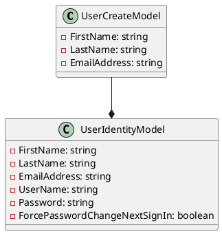

**README**

This repository provides two C# models for working with user data in a Microsoft B2C Identity system.

**Summary**

The `UserCreateModel` class is used to create a new user in a Microsoft B2C Identity system. It has properties for the user's first name, last name, and email address. The `UserIdentityModel` class is used to store user identity information, including the user's first name, last name, email address, username, and password. Additionally, it has a property for forcing the user to change their password at the next sign-in.

**Technical Summary**

The `UserCreateModel` class uses the `record` data type to define a struct-like data type, which is a value type that can be used to create immutable data objects. The `UserIdentityModel` class uses nullable reference types to indicate that certain properties may be null.

**Component Diagram**

This component diagram shows the relationship between the `UserCreateModel` and `UserIdentityModel` classes. The `UserCreateModel` is used to create a new user, and the `UserIdentityModel` is used to store user identity information. The `UserCreateModel` is a subclass of the `UserIdentityModel`.