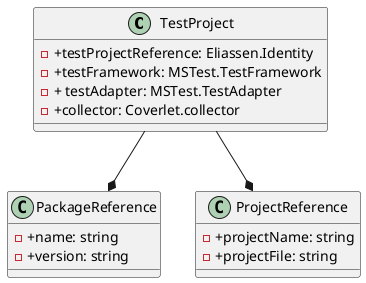

**Documentation for Eliassen.Identity.Tests.csproj**

**Overview**
----------

Eliassen.Identity.Tests.csproj is a test project for the Eliassen.Identity library, designed to test the features and functionality of the project.

**Configuration**
----------------

The project is configured to use the Microsoft.NET.Framework v8.0, with implicit usings disabled and nullable annotations enabled.

**Packages**
------------

The project references the following NuGet packages:

* Microsoft.NET.Test.Sdk v17.10.0
* MSTest.TestAdapter v3.4.3
* MSTest.TestFramework v3.4.3
* Coverlet.collector v6.0.2

**Project Reference**
----------------------

The project references the Eliassen.Identity.csproj project, located in the parent directory.

**Class Diagram (in PlantUML)**
--------------------------------

This class diagram shows the relationships between the classes in the Eliassen.Identity.Tests.csproj project. The TestProject class represents the project itself, and it has references to the Eliassen.Identity project, the MSTest.TestFramework and MSTest.TestAdapter NuGet packages, and the Coverlet.collector NuGet package. The PackageReference and ProjectReference classes are used to represent the NuGet packages and project references, respectively.