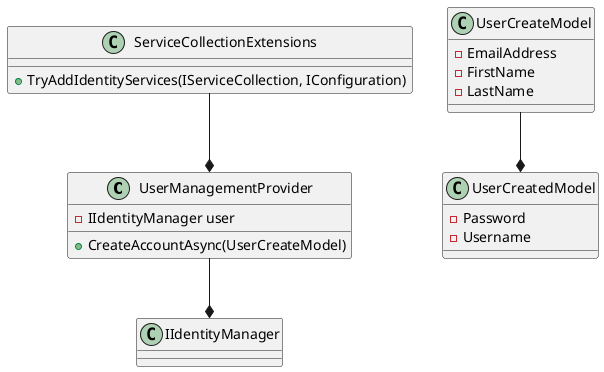

**Eliassen.Identity Documentation**

**Class Diagrams**

Using PlantUML, the class diagrams can be generated as follows:

**Readme.Identity.md**

# Eliassen.Identity

This documentation provides information on the Eliassen.Identity project, which provides services for user management.

**Class: Identity.UserManagementProvider**

The `UserManagementProvider` class represents a provider for user management operations. It provides a method `CreateAccountAsync` to create a new user account asynchronously.

### Methods

#### Constructor

The constructor initializes a new instance of the class, representing a provider for user management operations. It takes an optional parameter `user`, which is the user manager for managing graph users.

#### CreateAccountAsync

This method creates a new user account asynchronously. It takes a `UserCreateModel` object as a parameter, which contains the user information for account creation. The method returns a task representing the asynchronous operation, with the result being a `UserCreatedModel` object containing the created user's information.

**ServiceCollectionExtensions.cs**

This file contains a static class `ServiceCollectionExtensions` that provides extension methods for adding identity-related services to the service collection. The `TryAddIdentityServices` method adds the necessary services to the specified service collection using the provided configuration.

**UserManagementProvider.cs**

This file contains the `UserManagementProvider` class, which implements the `IUserManagementProvider` interface. It provides a single method `CreateAccountAsync` to create a new user account asynchronously. This method takes a `UserCreateModel` object as a parameter and returns a `UserCreatedModel` object containing the created user's information. If no identity management provider is registered, the method throws a `NotSupportedException`.