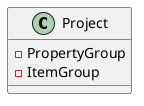
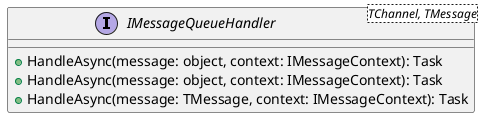
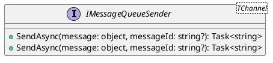
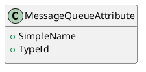
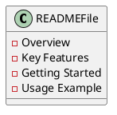

Here is the documentation for the source code files you provided, including class diagrams in PlantUML.

**Eliassen.MessageQueueing.Abstractions.csproj**

This is a .NET Core project file that defines the configurations and dependencies for the Eliassen.MessageQueueing.Abstractions library.

**Class Diagram for Eliassen.MessageQueueing.Abstractions.csproj**

**IMessageQueueHandler.cs**

This interface defines the generic contract for handling messages from a message queue.

**Class Diagram for IMessageQueueHandler.cs**

**IMessageQueueSender.cs**

This interface defines the generic contract for sending messages to a message queue.

**Class Diagram for IMessageQueueSender.cs**

**MessageQueueAttribute.cs**

This class attribute is used to mark a class as a message queue handler and provide configuration options.

**Class Diagram for MessageQueueAttribute.cs**

**Readme.MessageQueueing.Abstractions.md**

This is the README file for the Eliassen.MessageQueueing.Abstractions library, providing an overview, key features, getting started, and usage examples.

**Class Diagram for Readme.MessageQueueing.Abstractions.md**

Note: The class diagrams are generated using PlantUML and may not reflect the exact implementation details of the source code.