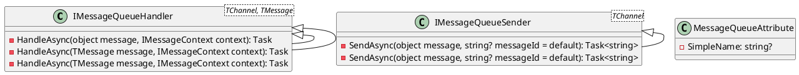
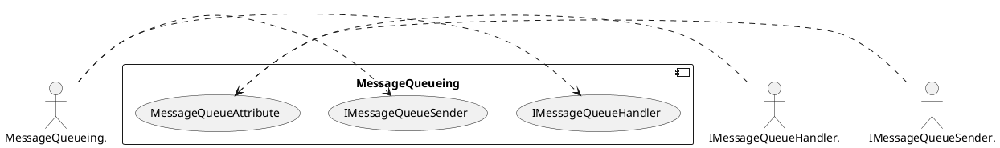
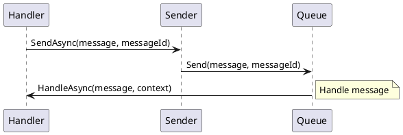

Here is the documentation for the provided source code in Markdown format, including PlantUML diagrams:

## Overview

The Eliassen.MessageQueueing.Abstractions library provides a comprehensive abstraction layer for interacting with message queues in .NET applications. It offers interfaces and classes for handling messages, sending messages, and receiving messages from various message queues. These abstractions enable developers to decouple their application logic from specific message queue implementations, facilitating easier testing, extensibility, and maintenance.

## Class Diagram


## Component Model


## Sequence Diagram


## Readme

```text
# Eliassen.MessageQueueing.Abstractions

## Overview

The Eliassen.MessageQueueing.Abstractions library provides a comprehensive abstraction layer for interacting with message queues in .NET applications. It offers interfaces and classes for handling messages, sending messages, and receiving messages from various message queues. These abstractions enable developers to decouple their application logic from specific message queue implementations, facilitating easier testing, extensibility, and maintenance.

## Key Features

- **Message Handling**: Provides generic interfaces for handling messages from message queues, allowing for flexible message processing logic.
- **Message Sending**: Offers generic interfaces for sending messages to message queues, supporting asynchronous message transmission.
- **Message Context**: Defines a message context interface to encapsulate metadata associated with messages, such as origin message ID, correlation ID, and message type.
- **Extensibility**: Enables developers to implement custom message queue handlers, senders, and receivers, supporting a wide range of message queue systems.
- **Configurability**: Allows for configuration-based setup of message queue providers, handlers, and senders, facilitating easy integration with different messaging platforms.
- **Ease of Testing**: Facilitates unit testing by providing interfaces that can be easily mocked or stubbed, allowing for isolated testing of message handling and sending logic.

## Getting Started

To use Eliassen.MessageQueueing.Abstractions in your .NET project, simply install the library via NuGet Package Manager:

```
dotnet add package Eliassen.MessageQueueing.Abstractions

## Usage Example

Here's a simple example demonstrating how to handle messages from a message queue using Eliassen.MessageQueueing.Abstractions:

```csharp
using Eliassen.MessageQueueing.Abstractions;

public class MyMessageHandler : IMessageQueueHandler
{
    public async Task HandleAsync(object message, IMessageContext context)
    {
        // Custom message handling logic
        await Task.CompletedTask;
    }
}
```