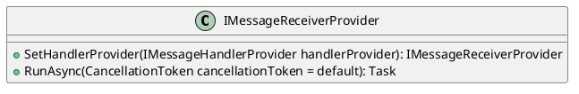
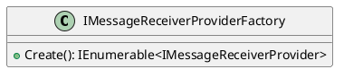
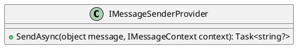
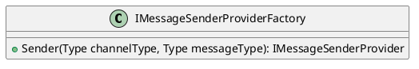
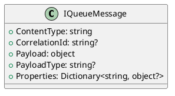
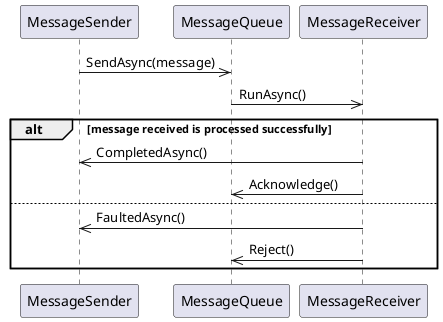

Here is the documentation for the source code in markdown format, with PlantUML diagrams as requested:

# Messaging Queueing Services

These services provide functionality for sending and receiving messages from a message queue.

## Interfaces

### IMessageReceiverProvider

Provides functionality for receiving messages from a message queue.

### IMessageReceiverProviderFactory

Factory for creating instances of IMessageReceiverProvider.

### IMessageSenderProvider

Represents a provider for sending messages to a message queue.

### IMessageSenderProviderFactory

Represents a factory for creating instances of IMessageSenderProvider.

### IQueueMessage

Represents a message within a message queue.

## Sequence Diagram

Here is a sequence diagram showing the interaction between the message sender and receiver:

This sequence diagram shows the interaction between the message sender, message queue, and message receiver. The sender sends a message to the queue, which is then processed by the receiver. The receiver then sends a completion async result back to the sender, and acknowledges the message if it was processed successfully, or faults the message if there was an error.