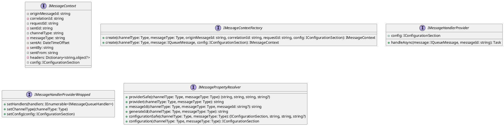

## Message Queueing Service

### Overview

The Eliassen Message Queueing Service is a .NET Core library that provides a mechanism for handling queue messages. It supports multiple message channels (e.g., RabbitMQ, Azure Service Bus) and provides a range of features for message processing, such as message routing, error handling, and configuration.

### Interfaces

#### IMessageContext

Represents the context of a message being processed in a message queue.

* `OriginMessageId`: Gets the origin message identifier.
* `CorrelationId`: Gets or sets the correlation identifier.
* `RequestId`: Gets the request identifier.
* `SentId`: Gets or sets the sent identifier.
* `ChannelType`: Gets the type of the channel.
* `MessageType`: Gets the type of the message.
* `SentAt`: Gets the timestamp when the message was sent.
* `SentBy`: Gets the entity that sent the message.
* `SentFrom`: Gets the entity from which the message was sent.
* `Headers`: Gets the collection of headers associated with the message.
* `Config`: Gets the configuration section associated with the message context.

#### IMessageContextFactory

Factory for creating instances of `IMessageContext`.

* `Create`: Creates a new instance of `IMessageContext` with the specified parameters.
* `Create` (overloaded): Creates a new instance of `IMessageContext` for the given channel and message.

#### IMessageHandlerProvider

Provides a mechanism for handling queue messages.

* `HandleAsync`: Handles the specified queue message with the given message identifier.
* `Config`: Gets the configuration section associated with the message handler provider.

#### IMessageHandlerProviderWrapped

Internal interface for wrapping `IMessageHandlerProvider`.

* `SetHandlers`: Sets the collection of message queue handlers for the provider.
* `SetChannelType`: Sets the type of the message channel for the provider.
* `SetConfig`: Sets the configuration section for the provider.

#### IMessagePropertyResolver

Resolves properties related to message handling.

* `ProviderSafe`: Retrieves provider information for the specified message channel and message types.
* `Provider`: Retrieves the provider key for the specified message channel and message types.
* `MessageId`: Retrieves the message ID for the specified message channel, message type, and optional original message ID.
* `GenerateId`: Generates a unique ID for the specified message channel and message types.
* `ConfigurationSafe`: Retrieves configuration information for the specified message channel and message types.
* `Configuration`: Retrieves the configuration section for the specified message channel and message types.

### Class Diagram



### Sequence Diagram

```plantuml
@startuml
sequenceDiagram
    participant IMQueueingService as "IMQueueingService"
    participant IMessageContextFactory as "IMessageContextFactory"
    participant IMessageHandlerContext as "IMessageHandlerContext"
    participant IMessageQueueHandler as "IMessageQueueHandler"

    note "Create message context"
    IMQueueingService->>IMessageContextFactory: Create message context
    IMMessageContextFactory->>IMessageHandlerContext: Create
    note "Create message handler"
    IMMessageHandlerContext->>IMMessageQueueHandler: Create
    note "Handle message"
    IMMessageQueueHandler->>IMMessageHandlerContext: Handle
    IMMessageHandlerContext->>IMQueueingService: Handle
    note "Dispose message handler"
    IMMessageHandlerContext