Here is the documentation for the given source code files, including class diagrams in PlantUML.

**IMessageContext.cs**

This interface represents the context of a message being processed in a message queue.

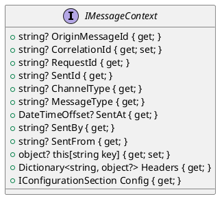

**IMessageContextFactory.cs**

This interface provides a factory for creating instances of `IMessageContext`.

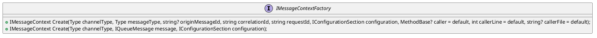

**IMessageHandlerProvider.cs**

This interface provides a mechanism for handling queue messages.

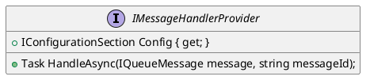

**IMessageHandlerProviderWrapped.cs**

This interface provides internal extensions for mechanism for handling queue messages.

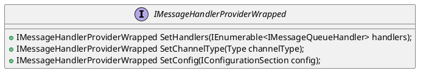

**IMessagePropertyResolver.cs**

This interface resolves properties related to message handling, such as provider, message ID, and configuration.

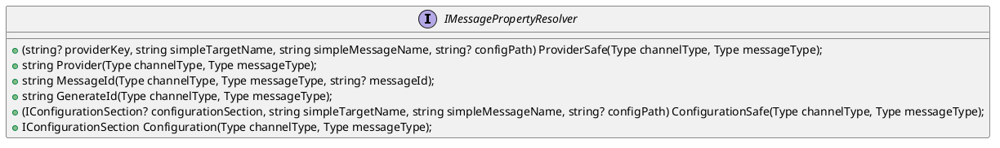

**IMessageReceiverProvider.cs**

This interface provides functionality for receiving messages from a message queue.

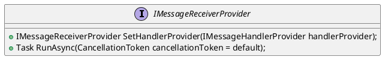

**IMessageReceiverProviderFactory.cs**

This interface provides a factory for creating instances of `IMessageReceiverProvider`.

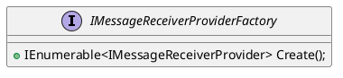

**IMessageSenderProvider.cs**

This interface represents a provider for sending messages to a message queue.

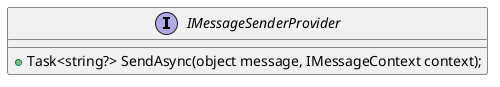

**IMessageSenderProviderFactory.cs**

This interface provides a factory for creating instances of `IMessageSenderProvider`.

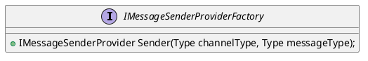

**IQueueMessage.cs**

This interface represents a message within a message queue.

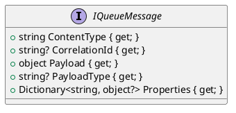

**WrappedQueueMessage.cs**

This class represents a wrapped queue message.

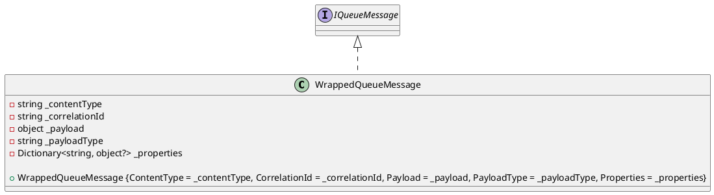

Please note that this documentation is generated based on the