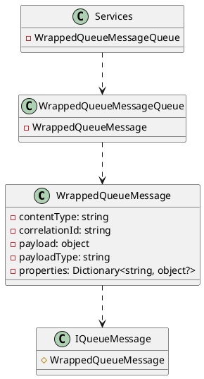

**README File**

**Overview**

The Eliassen.MessageQueueing.Services namespace contains a set of services designed for implementing message queueing functionality. The primary objective is to provide a robust and flexible framework for handling message-based communication between applications and services.

**Summary**

The services provided by Eliassen.MessageQueueing.Services are centered around the concept of a "wrapped queue message". This message wraps a payload with additional metadata, such as content type, correlation ID, payload type, and properties. The services allow for the creation, management, and processing of these wrapped queue messages.

**Technical Summary**

The design of the services is based on the principles of microservices architecture, with a focus on simplicity, scalability, and maintainability. The `WrappedQueueMessage` class, in particular, implements the `IQueueMessage` interface, following the dependency injection pattern. The use of a getter-initter pattern for properties such as `ContentType`, `CorrelationId`, `Payload`, and `PayloadType` allows for flexible initialization and data binding.

**Component Diagram**

In this component diagram, we can see the relationships between the classes and components:

* `WrappedQueueMessage` implements the `IQueueMessage` interface.
* `WrappedQueueMessageQueue` wraps individual `WrappedQueueMessage` instances.
* `Services` encapsulates the messaging functionality, which interacts with `WrappedQueueMessageQueue`.