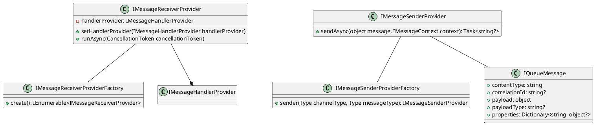

**README**

**Summary**

The Eliassen.MessageQueueing.Services namespace contains interfaces for message queueing services. It provides functionality for receiving and sending messages to a message queue. The provided services allow for creating and managing instances of message receiver and sender providers, which can be used to handle messages asynchronously.

**Technical Summary**

The provided interfaces utilize various design patterns and architectural patterns:

* **Factory Patterns**: `IMessageReceiverProviderFactory` and `IMessageSenderProviderFactory` interfaces provide factories for creating instances of `IMessageReceiverProvider` and `IMessageSenderProvider` respectively. This allows for decoupling the creation of these providers from their clients.
* **Dependency Injection**: The `IMessageReceiverProvider` and `IMessageSenderProvider` interfaces rely on dependency injection, where the handler provider and channel type/message type are provided externally.
* **Asynchronous Programming**: The `IMessageReceiverProvider` interface provides a method for running the message receiver asynchronously, and the `IMessageSenderProvider` interface provides a method for sending a message asynchronously.

**Component Diagram**

This component diagram illustrates the relationships between the provided interfaces. The `IMessageReceiverProvider` and `IMessageSenderProvider` interfaces rely on their respective factory interfaces for creation. The `IMessageReceiverProvider` interface also uses a `IMessageHandlerProvider` and the `IMessageSenderProvider` interface uses an `IQueueMessage`.