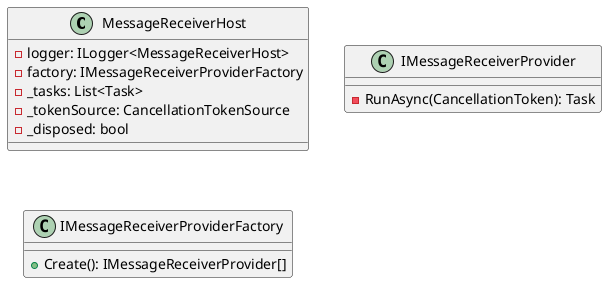

Here is the documentation for the provided source code:

**README.md**

# Eliassen.MessageQueueing.Hosting

This is a .NET Core library that provides a hosted service for starting and stopping message receivers based on the configured providers. It's designed to be used with Microsoft.Extensions.Hosting and Microsoft.Extensions.Logging.

**MessageReceiverHost**

The `MessageReceiverHost` class is responsible for starting and stopping message receivers based on the configured providers. It's implemented as a hosted service and provides methods for starting and stopping the service.

### Methods

#### Constructor

Initializes a new instance of the `MessageReceiverHost` class.

##### Parameters

* `logger`: The logger.
* `factory`: The message receiver provider factory.

#### Dispose

Disposes of the resources used by the `MessageReceiverHost`.

#### Dispose(bool)

Disposes of the resources used by the `MessageReceiverHost`.

##### Parameters

* `disposing`

#### StartAsync(CancellationToken)

Starts the message receiver host.

##### Parameters

* `cancellationToken`: The cancellation token.

##### Return value

A task representing the start operation.

#### StopAsync(CancellationToken)

Stops the message receiver host.

##### Parameters

* `cancellationToken`: The cancellation token.

##### Return value

A task representing the stop operation.

**Sequence Diagram**
```plantuml
@startuml
sequenceDiagram
  participant Host as "Host"
  participant MessageReceiverHost as "MessageReceiverHost"
  participant IMessageReceiverProvider as "IMessageReceiverProvider"
  participant IMessageReceiverProviderFactory as "IMessageReceiverProviderFactory"
  note "Start" as start
  Host->>MessageReceiverHost: Start
  MessageReceiverHost->>IMessageReceiverProviderFactory: Create
  IMessageReceiverProviderFactory->>IMessageReceiverProvider[]
  MessageReceiverHost->>IMessageReceiverProvider[]: Start
  note "Stop" as stop
  Host->>MessageReceiverHost: Stop
  MessageReceiverHost->>IMessageReceiverProvider[]: Stop
@enduml
```
**Class Diagram**

**How to use**

To use the `MessageReceiverHost` class, you'll need to add the following lines to your `Startup.cs` file in the `ConfigureServices` method:
```csharp
services.TryAddMessageQueueingHosting();
```
This will add the `MessageReceiverHost` to the service collection and configure it to start and stop the message receivers based on the configured providers.

Note: The `MessageReceiverHost` class is designed to be used with Microsoft.Extensions.Hosting and Microsoft.Extensions.Logging.