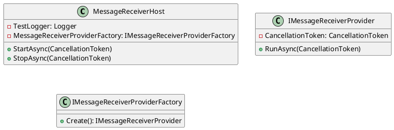

# Message Receiver Host Tests

## Overview

The `MessageReceiverHostTests` class contains unit tests for the `MessageReceiverHost` class, which is responsible for hosting message receivers and managing their lifecycle.

## Class Diagram



## Component Model

```plantuml
@startuml
component MessageReceiverHost {
  database TestLogger[*]
  database IMessageReceiverProvider[*]
  database IMessageReceiverProviderFactory[*]
}
@enduml
```

## Sequence Diagram

```plantuml
@startuml
sequenceDiagram
actor User as "User"
participant MessageReceiverHost as "Host"
participant TestLogger as "Logger"
participant IMessageReceiverProviderFactory as "Factory"
participant IMessageReceiverProvider as "Receiver"

User->>Host: StartAsync(cancellationTokenSource.Token)
Host->>Factory: Create()
Factory->>Receiver: Return
Host->>Receiver: RunAsync(cancellationTokenSource.Token)
Receiver->>Host: RanChild!
Receiver->>Logger: Log message
Receiver->>User: Spin! { spinCount++ }
User->>Host: StopAsync(cancellationTokenSource.Token)
Host->>Receiver: Stop()
@enduml
```

## Code

```csharp
using Eliassen.MessageQueueing.Hosting;
using Eliassen.MessageQueueing.Services;
using Eliassen.TestUtilities;
using Microsoft.VisualStudio.TestTools.UnitTesting;
using Moq;
using System.Threading;
using System.Threading.Tasks;

namespace Eliassen.MessageQueueing.Tests.Hosting
{
    [TestClass]
    public class MessageReceiverHostTests
    {
        public required TestContext TestContext { get; set; }

        [TestMethod]
        [TestCategory(TestCategories.Unit)]
        public async Task StartStopTest()
        {
            // Arrange
            var cancellationTokenSourceBlocker = new CancellationTokenSource();
            var cancellationTokenSource = new CancellationTokenSource();

            var mockRepo = new MockRepository(MockBehavior.Strict);
            var mockReceiverProviderFactory = mockRepo.Create<IMessageReceiverProviderFactory>();
            var mockReceiverProvider = mockRepo.Create<IMessageReceiverProvider>();

            mockReceiverProvider
                .Setup(s => s.RunAsync(It.IsAny<CancellationToken>()))
                .Returns(Task.CompletedTask)
                .Callback(async () =>
                {
                    TestContext.WriteLine("Ran Child!");
                    await cancellationTokenSourceBlocker.CancelAsync();
                    await Task.Delay(100);
                });
            mockReceiverProviderFactory
                .Setup(s => s.Create())
                .Returns(mockReceiverProvider.Object);

            // Act
            using (var host = new MessageReceiverHost(
                TestLogger.CreateLogger<MessageReceiverHost>(),
                mockReceiverProviderFactory.Object
              ))
            {
                await host.StartAsync(cancellationTokenSource.Token);

                var spinCount = 0;
                while (!cancellationTokenSourceBlocker.IsCancellationRequested)
                {
                    TestContext.WriteLine($"Spin! : {spinCount++}");
                    await Task.Yield();
                }
                await host.StopAsync(cancellationTokenSource.Token);
            }

            // Assert
            mockRepo.VerifyAll();
        }
    }
}
```