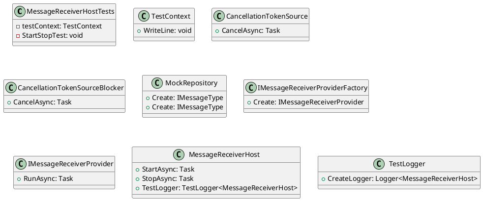

**MessageReceiverHostTests Documentation**

**Class Diagram**

**Class Description**

The `MessageReceiverHostTests` class is a unit test class that tests the `MessageReceiverHost` class. It contains a single test method `StartStopTest` that tests the start and stop functionality of the `MessageReceiverHost`.

The `MessageReceiverHost` class is the class under test, which manages the start and stop of message receivers. It has a `StartAsync` method that starts the message receivers, and a `StopAsync` method that stops them.

The `IMessageReceiverProviderFactory` interface is responsible for creating instances of `IMessageReceiverProvider`. The `IMessageReceiverProvider` interface defines the `RunAsync` method that runs the message receiver.

The `CancellationTokenSource` class is used to cancel the message receiver after a certain interval.

The `TestContext` class is used to write log messages during the test execution.

**Method Description**

The `StartStopTest` method tests the start and stop functionality of the `MessageReceiverHost` class.

1. It creates a `CancellationTokenSource` and a `CancellationTokenSourceBlocker` to cancel the message receiver after a certain interval.
2. It creates a `MockRepository` to create instances of `IMessageReceiverProvider` and `IMessageReceiverProviderFactory`.
3. It creates a `MessageReceiverHost` instance and sets up the `IMessageReceiverProviderFactory` and `IMessageReceiverProvider` mocks.
4. It starts the message receiver using the `StartAsync` method.
5. It waits for the message receiver to run using a loop that checks for cancellation.
6. It stops the message receiver using the `StopAsync` method.
7. It verifies that all mock expectations were met.

**Notes**

* The test uses the `TestContext` class to write log messages during the test execution.
* The test uses the `CancellationTokenSource` class to cancel the message receiver after a certain interval.
* The test uses the `MockRepository` class to create instances of `IMessageReceiverProvider` and `IMessageReceiverProviderFactory`.
* The test verifies that all mock expectations were met using the `VerifyAll` method.