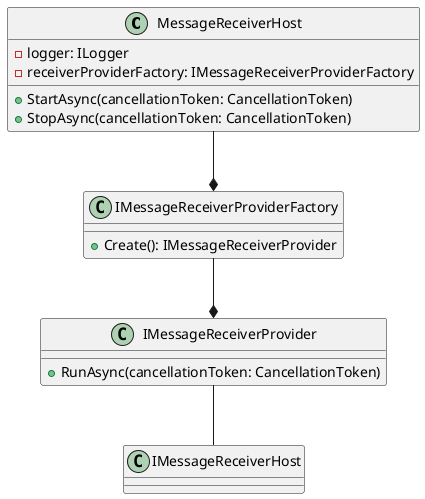

**README**

This repository contains a set of .NET Core tests for a message queueing hosting system. The tests are designed to verify the functionality of the message receiver host, which is responsible for starting and stopping message receivers.

**Summary**

The MessageReceiverHost is a component that manages the lifetime of message receivers. It takes a factory for creating message receiver providers and an instance of a logger. The host has methods for starting and stopping the message receivers. In this implementation, the host is tested using a set of unit tests.

**Technical Summary**

The design pattern used in this implementation is the **Composite** pattern. The MessageReceiverHost is a composite of message receiver providers, which can be thought of as individual leaf components. The host provides a way to start and stop all the underlying providers, while each provider is responsible for starting and stopping its own message receiver.

The architectural pattern used is **Microservices**. Each message receiver provider is a separate service that can be managed independently. The MessageReceiverHost is a dispatcher that coordinates the start and stop requests to these services.

**Component Diagram**

