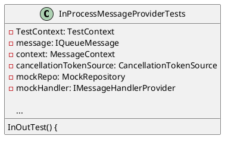
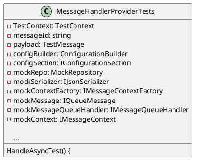
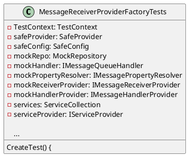

Here is the documentation for the source code files, including class diagrams in PlantUML:

**InProcessMessageProviderTests.cs**

Class Diagram:

Description:
This file contains a test class for the `InProcessMessageProvider` class. The test class uses the `TestContext` class to set up and tear down tests. It uses the `Moq` library to mock the `IMessageHandlerProvider` interface. The test class sends a message using the `InProcessMessageProvider` and verifies that the handler is called using the mocked `IMessageHandlerProvider`.

**MessageHandlerProviderTests.cs**

Class Diagram:

Description:
This file contains a test class for the `MessageHandlerProvider` class. The test class uses the `TestContext` class to set up and tear down tests. It uses the `Moq` library to mock several interfaces, including `IJsonSerializer`, `IMessageContextFactory`, `IQueueMessage`, `IMessageQueueHandler`, and `IMessageContext`. The test class verifies that the `HandleAsync` method is called correctly using the mocked interfaces.

**MessageReceiverProviderFactoryTests.cs**

Class Diagram:

Description:
This file contains a test class for the `MessageReceiverProviderFactory` class. The test class uses the `TestContext` class to set up and tear down tests. It uses the `Moq` library to mock several interfaces, including `IMessageQueueHandler`, `IMessagePropertyResolver`, `IMessageReceiverProvider`, and `IMessageHandlerProvider`. The test class verifies that the `Create` method returns a list of `IMessageReceiverProviders` using the mocked interfaces.

Note: The class diagrams are generated using PlantUML and are intended to provide a visual representation of the relationships between classes in the source code files.