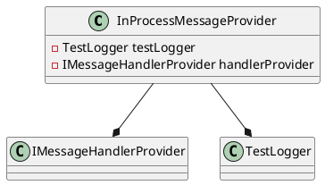
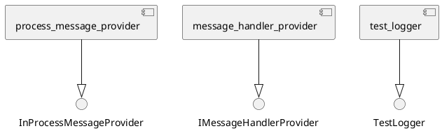
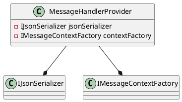
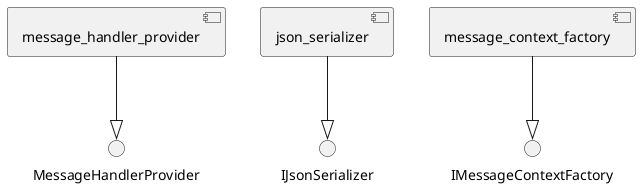
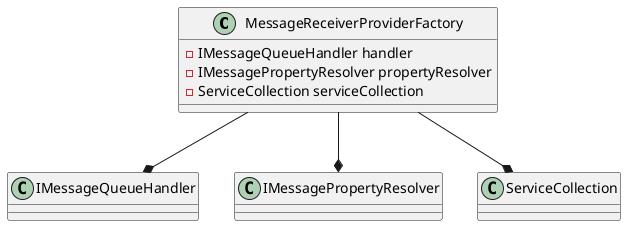
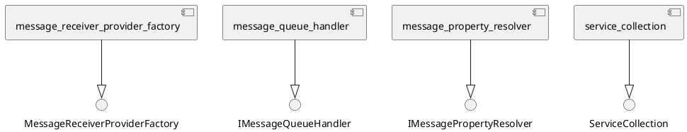

Here is the documentation for the provided source code in Markdown format:

# Eliassen.MessageQueueing.Services Tests

## Overview

This section provides documentation for the unit tests of the Eliassen.MessageQueueing.Services namespace.

### InProcessMessageProviderTests

```InProcessMessageProviderTests.cs
```

The `InProcessMessageProviderTests` class contains the unit tests for the `InProcessMessageProvider` class. This class is responsible for sending and processing messages in-process.

#### InOutTest

The `InOutTest` method tests the `SendAsync` method of the `InProcessMessageProvider` class. It sets up a mock handler and a message context, and then sends a message and verifies that it is processed correctly.

### Class Diagram



### Component Model



### Sequence Diagram

```plantuml
@startuml
participant InProcessMessageProvider as ipmp
participant IMessageHandlerProvider as imhp
participant TestLogger as tl

note "Setup handler provider" as n1
imhp/plugin_inProcessMessageProvider:setHandlerProvider(ipmp)

note "Send message" as n2
ipmp/sendAsync(message:TestMessage):correlationId

note "Handle message" as n3
imhp/handleAsync(message:TestMessage):completedTask

note "Run" as n4
ipmp/runAsync(cancellationToken: CancellationToken):completedTask
@enduml
```

## MessageHandlerProviderTests

```MessageHandlerProviderTests.cs
```

The `MessageHandlerProviderTests` class contains the unit tests for the `MessageHandlerProvider` class. This class is responsible for providing message handlers.

### HandleAsyncTest

The `HandleAsyncTest` method tests the `HandleAsync` method of the `MessageHandlerProvider` class. It sets up a mock serializer, context factory, and message queue handler, and then handles a message and verifies that it is processed correctly.

### Class Diagram



### Component Model



### Sequence Diagram

```plantuml
@startuml
participant MessageHandlerProvider as mhp
participant IJsonSerializer as js
participant IMessageContextFactory as icf
participant IQueueMessage as im

note "Create context" as n1
icf/create(message: IQueueMessage):messageContext

note "Handle message" as n2
mhp/handleAsync(message: IQueueMessage, correlationId: string):completedTask

note "Serialize" as n3
js/serialize(message: IQueueMessage):serializedMessage

note "Process message" as n4
icf/setMessageContext(im, messageContext)

@enduml
```

## MessageReceiverProviderFactoryTests

```MessageReceiverProviderFactoryTests.cs
```

The `MessageReceiverProviderFactoryTests` class contains the unit tests for the `MessageReceiverProviderFactory` class. This class is responsible for creating message receiver providers.

### CreateTest

The `CreateTest` method tests the `Create` method of the `MessageReceiverProviderFactory` class. It sets up a mock handler, property resolver, and receiver provider, and then creates a message receiver provider and verifies that it is created correctly.

### Class Diagram



### Component Model



### Sequence Diagram

```plantuml
@startuml
participant MessageReceiverProviderFactory as mrpf
participant