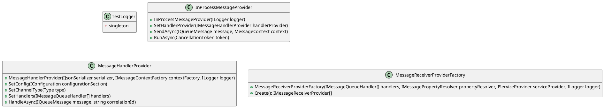

**README**

The following readme describes the general functionality of the provided source files, including design patterns and architectural patterns used.

**Summary**

The source files comprise three .NET Core classes that implement message queueing services. The classes are designed to work together to provide a robust message queueing system.

- `InProcessMessageProviderTests.cs`: This file contains unit tests for the `InProcessMessageProvider` class, which is responsible for sending and receiving messages within a process.
- `MessageHandlerProviderTests.cs`: This file contains unit tests for the `MessageHandlerProvider` class, which is responsible for handling messages and providing a way to send and receive messages.
- `MessageReceiverProviderFactoryTests.cs`: This file contains unit tests for the `MessageReceiverProviderFactory` class, which is responsible for creating and managing message receiver providers.

**Technical Summary**

The source files utilize several design patterns and architectural patterns to achieve their functionality.

- **Singleton Pattern**: The `TestLogger` class uses the Singleton pattern to ensure a single instance of the logger is created.
- **Factory Pattern**: The `MessageReceiverProviderFactory` class uses the Factory pattern to create instances of `MessageReceiverProvider`.
- **Dependency Injection**: The `MessageHandlerProvider` and `MessageReceiverProviderFactory` classes use dependency injection to inject their dependencies.
- **Mocking**: The tests use mocking libraries (e.g., Moq) to create mock objects that mimic the behavior of real objects.

**Component Diagram**

Here is a component diagram of the system using PlantUML:



```plantuml
@startuml
component InProcessMessageProvider {
  InProcessMessageProvider
}
component MessageHandlerProvider {
  MessageHandlerProvider
}
component MessageReceiverProviderFactory {
  MessageReceiverProviderFactory
}
component TestLogger {
  TestLogger
}

InProcessMessageProvider -> MessageHandlerProvider: SetHandlerProvider
MessageHandlerProvider -> MessageReceiverProviderFactory: Create
MessageReceiverProviderFactory -> InProcessMessageProvider: Create
@enduml
```

Note: The above component diagrams illustrate the relationships between the classes and components, but may not be a comprehensive representation of the entire system architecture.