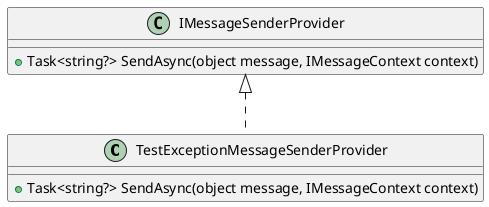
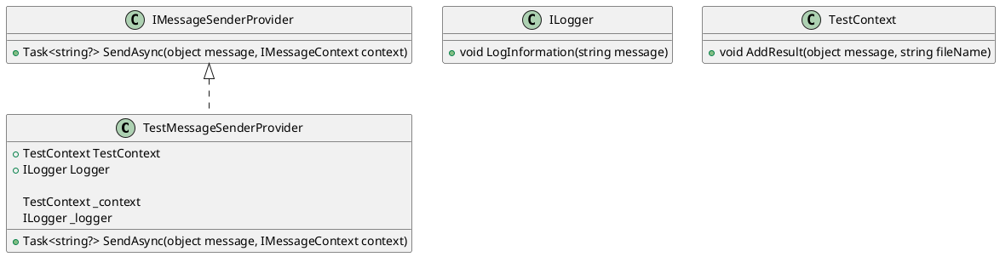

Here is the generated documentation for the source code files, including class diagrams in PlantUML:

**TestExceptionMessageSenderProvider.cs**
```
== Class Diagram ==

**Documentation**

The `TestExceptionMessageSenderProvider` class is a test implementation of the `IMessageSenderProvider` interface. It sends a task that completes with an exception instead of sending a message.

**TestMessage.cs**
```
== No Class Diagram ==
```
**Documentation**

The `TestMessage` class is an empty class with no properties or methods. It is likely intended as a placeholder for a specific message type.

**TestMessageSenderProvider.cs**
```
== Class Diagram ==

**Documentation**

The `TestMessageSenderProvider` class is a test implementation of the `IMessageSenderProvider` interface. It takes a `TestContext` and `ILogger` in its constructor and uses them to log information and store results. The `SendAsync` method logs a message, stores the message and context in the test context, and returns a task that completes with a null result.

Note: The `ILogger` and `TestContext` classes are not shown in their entirety, as they are not provided in the source code.