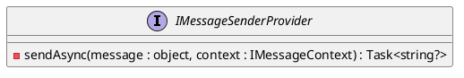

Here is the documentation for the provided source code in markdown format, including class diagrams, component models, and sequence diagrams in PlantUML.

## Introduction

This documentation provides an overview of the Eliassen.MessageQueueing.Services namespace, specifically focusing on the IMessageSenderProvider, TestExceptionMessageSenderProvider, TestMessage, and TestMessageSenderProvider classes.

## API Overview

Below is a high-level overview of the API, including the classes and methods used in the tests.

### IMessageSenderProvider

