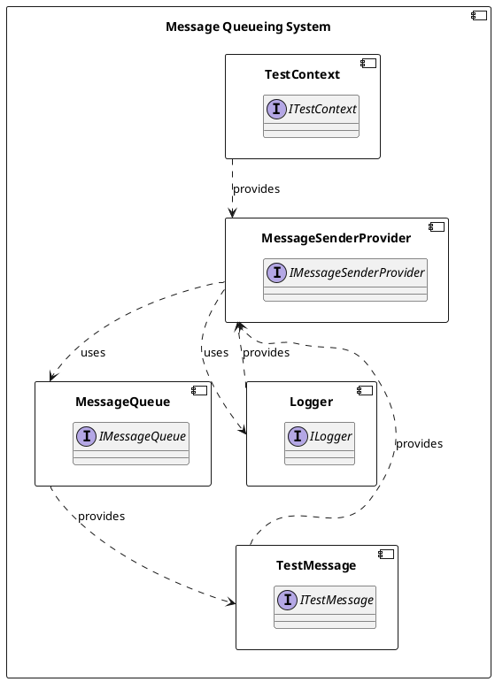

**README.md**

**Summary**

The provided files constitute a set of test classes for a message queueing system. The classes are designed to simulate the sending and processing of messages through a message queue. The `TestExceptionMessageSenderProvider` class mimics an exception scenario, while the `TestMessageSenderProvider` class provides a functional example of sending messages. The `TestMessage` class serves as a placeholder for a real-world message class.

**Technical Summary**

The design pattern used in these files is the Factory Pattern, as evident in the `TestMessageSenderProvider` class. The class takes in a `TestContext` instance and a logger, which are then used to process and log messages. The `TestExceptionMessageSenderProvider` class exemplifies the use of the Exception Handling pattern by raising an `ApplicationException` when sending a message.

**Component Diagram**

This component diagram illustrates the relationships between the classes and interfaces in the message queueing system. The `MessageSenderProvider` component uses the `Logger` and `MessageQueue` components to send messages. The `TestContext` component provides input to the `MessageSenderProvider` component. The `TestMessage` component is provided by the `MessageQueue` component.