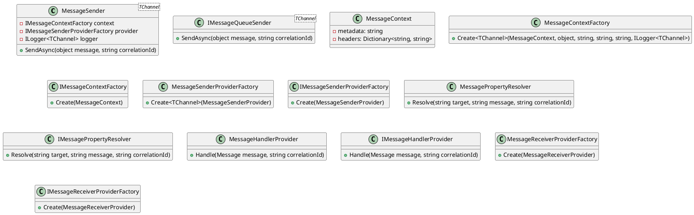

**Documentation for Eliassen.MessageQueueing.csproj**

Eliassen.MessageQueueing is a .NET Core 8.0 library that provides a message queuing system for sending and receiving messages. The source code consists of classes and interfaces that provide functionality for message queuing and processing.

**Classes and Interfaces**

* **MessageSender<TChannel>**: Represents a message sender for a specific communication channel (TChannel).
* **IMessageQueueSender<TChannel>**: Interface for IMessageSender<TChannel>.
* **MessageContext**: Represents the context associated with a message, including metadata and headers.
* **MessageContextFactory**: Factory for creating instances of MessageContext.
* **IMessageContextFactory**: Interface for MessageContextFactory.
* **MessageSenderProviderFactory**: Factory for creating instances of MessageSenderProvider.
* **IMessageSenderProviderFactory**: Interface for MessageSenderProviderFactory.
* **MessagePropertyResolver**: Utility class for resolving properties related to message queue handling.
* **IMessagePropertyResolver**: Interface for MessagePropertyResolver.
* **MessageHandlerProvider**: Provides handling of queue messages by coordinating multiple IMessageQueueHandler instances.
* **IMessageHandlerProvider**: Interface for MessageHandlerProvider.
* **MessageReceiverProviderFactory**: Factory for creating instances of MessageReceiverProvider.
* **IMessageReceiverProviderFactory**: Interface for MessageReceiverProviderFactory.

**Methods**

* **SendAsync(object, string)**: Sends a message asynchronously to the specified communication channel.
* **TryAddMessageQueueingServices(IServiceCollection)**: Configures services for Message Queueing within this library.

**Class Diagram in Plant UML**

This class diagram shows the relationships between the classes and interfaces in the Eliassen.MessageQueueing library. It includes the MessageSender class and its interfaces, as well as other classes and interfaces that support message queuing and processing.

**Readme.MessageQueueing.md**

The Readme.MessageQueueing.md file provides a brief overview of the Eliassen.MessageQueueing library, including its purpose, methods, and fields.

**ServiceCollectionExtensions.cs**

The ServiceCollectionExtensions.cs file provides extension methods for configuring IoC (Inversion of Control) services to support all Message Queueing within this library. The `TryAddMessageQueueingServices` method configures services for Message Queueing and returns the modified service collection.

I hope this documentation helps to provide a clear understanding of the Eliassen.MessageQueueing library and its functionality.