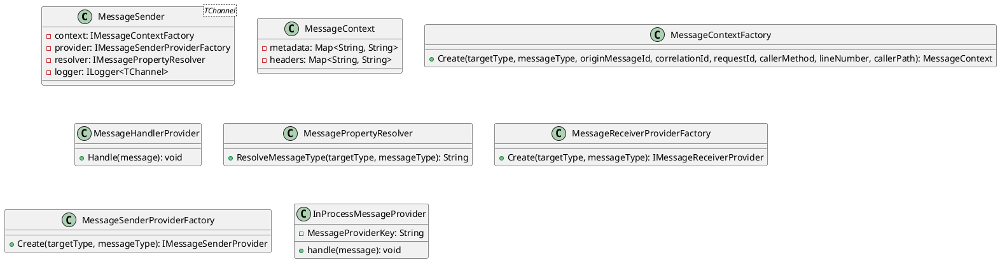

**MessageQueueing Documentation**

**Introduction**
===============

The MessageQueueing library provides a set of services for sending and receiving messages through a communication channel. This library is designed to be flexible and configurable, allowing users to customize the behavior and functionality of the message handling process.

**Overview**
==========

The MessageQueueing library consists of the following components:

* `MessageSender<TChannel>`: A message sender that sends messages asynchronously to a specific communication channel.
* `ServiceCollectionExtensions`: Extension methods for configuring IoC services for Message Queueing.
* `MessageContext`: The context associated with a message, including metadata and headers.
* `MessageContextFactory`: Factory for creating instances of `MessageContext`.
* `MessageHandlerProvider`: Provides handling of queue messages by coordinating multiple `IMessageQueueHandler` instances.
* `MessagePropertyResolver`: Utility class for resolving properties related to message queue handling.
* `MessageReceiverProviderFactory`: Factory for creating instances of `IMessageReceiverProvider` based on configured message handlers.
* `MessageSenderProviderFactory`: Factory for creating instances of `IMessageSenderProvider` based on channel and message types.

**Class Diagram**
================



**ServiceCollectionExtensions**
-----------------------------

The `ServiceCollectionExtensions` class provides extension methods for configuring IoC services for Message Queueing within the library. The `TryAddMessageQueueingServices` method adds IOC configurations to support all Message Queueing within this library.

**Sequence Diagram**
-------------------

```plantuml
@startuml
sequenceDiagram
    participant Sender as "MessageSender<TChannel>"
    participant Receiver as "MessageReceiver"
    participant Context as "MessageContext"
    participant Resolver as "MessagePropertyResolver"

    note "Create message context" as "context"
    Sender->>Context: Create(targetType, messageType, originMessageId, correlationId, requestId, callerMethod, lineNumber, callerPath)
    alt "Send message"
        Sender->>Resolver: ResolveMessageType(targetType, messageType)
        Resolver->>Context: Set metadata and headers
        Sender->>Receiver: Send(message, Context)
        Receiver->>Sender: SentId
    else "Error handling"
        Sender->>Resolver: Get error message
        Resolver->>Context: Set error metadata and headers
        Sender->>Receiver: Error handling(message, Context)
        Receiver->>Sender: Error handling message
    end
@enduml
```

**Conclusion**
==========

The MessageQueueing library provides a set of services for sending and receiving messages through a communication channel. The library is designed to be flexible and configurable, allowing users to customize the behavior and functionality of the message handling process. The provided documentation includes a class diagram, sequence diagram, and component model to help users understand the architecture and functionality of the library.