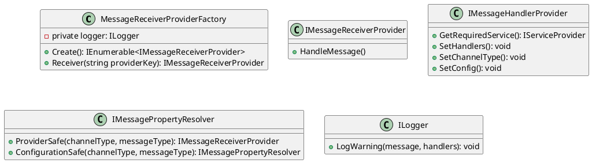
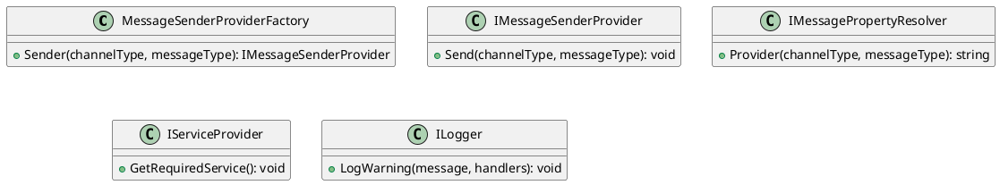

# Message Receiver Provider Factory Documentation
====================================================

## Overview
-----------

The Message Receiver Provider Factory is responsible for creating instances of `IMessageReceiverProvider` based on configured message handlers. This factory uses the `IMessagePropertyResolver` to resolve the correct message receiver provider for each handler.

## Class Diagram
---------------

## Method Descriptions
--------------------

### `Create()`

Creates instances of `IMessageReceiverProvider` based on configured message handlers.

### `Receiver(string providerKey)`

Resolves an instance of `IMessageReceiverProvider` using the provided provider key.

## Message Sender Provider Factory Documentation
================================================___

## Overview
-----------

The Message Sender Provider Factory is responsible for creating instances of `IMessageSenderProvider` based on channel and message types.

### Class Diagram
---------------

### Method Descriptions
--------------------

### `Sender(Type channelType, Type messageType)`

Creates an instance of `IMessageSenderProvider` based on the provided channel and message types.