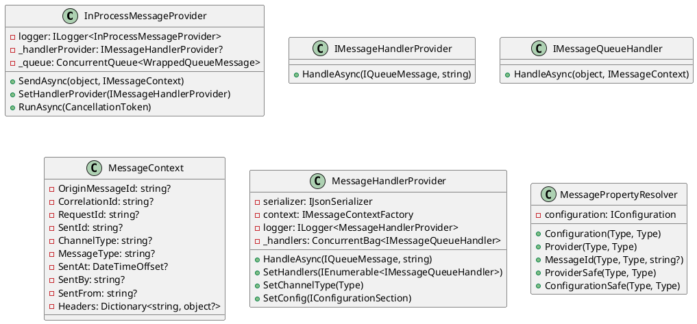

Here is the documentation for the provided source code in markdown format.

**Message Queueing Service**
==========================

### Class Diagram

### Components
#### In-Process Message Provider
The `InProcessMessageProvider` class is responsible for sending and receiving messages in an in-process message queue. It implements both `IMessageSenderProvider` and `IMessageReceiverProvider` interfaces.

* `SendAsync(object, IMessageContext)`: Sends a message asynchronously.
* `SetHandlerProvider(IMessageHandlerProvider)`: Sets the message handler provider.
* `RunAsync(CancellationToken)`: Runs the in-process message provider asynchronously.

#### Message Handler Provider
The `MessageHandlerProvider` class provides handling of queue messages by coordinating multiple `IMessageQueueHandler` instances.

* `HandleAsync(IQueueMessage, string)`: Handles the specified queue message by invoking each registered message handler.
* `SetHandlers(IEnumerable<IMessageQueueHandler>)`: Sets the message handlers.
* `SetChannelType(Type)`: Sets the channel type.
* `SetConfig(IConfigurationSection)`: Sets the configuration section.

#### Message Context
The `MessageContext` class represents the context associated with a message, including metadata and headers.

* `OriginMessageId`: Gets or sets the origin message ID.
* `CorrelationId`: Gets or sets the correlation ID.
* `RequestId`: Gets or sets the request ID.
* `SentId`: Gets or sets the sent ID.
* `ChannelType`: Gets or sets the channel type.
* `MessageType`: Gets or sets the message type.
* `SentAt`: Gets or sets the timestamp when the message was sent.
* `SentBy`: Gets or sets the entity that sent the message.
* `SentFrom`: Gets or sets the origin from where the message was sent.
* `Headers`: Gets or sets the headers associated with the message context.

#### Message Property Resolver
The `MessagePropertyResolver` class provides a utility for resolving properties related to message queue handling.

* `Configuration(Type, Type)`: Retrieves the safe configuration section along with simple target and message names.
* `Provider(Type, Type)`: Retrieves the provider key along with simple target and message names.
* `MessageId(Type, Type, string?)`: Resolves the message ID, generating a new one if not provided.
* `ProviderSafe(Type, Type)`: Retrieves the safe provider information along with simple target and message names.
* `ConfigurationSafe(Type, Type)`: Retrieves the safe configuration section along with simple target and message names.