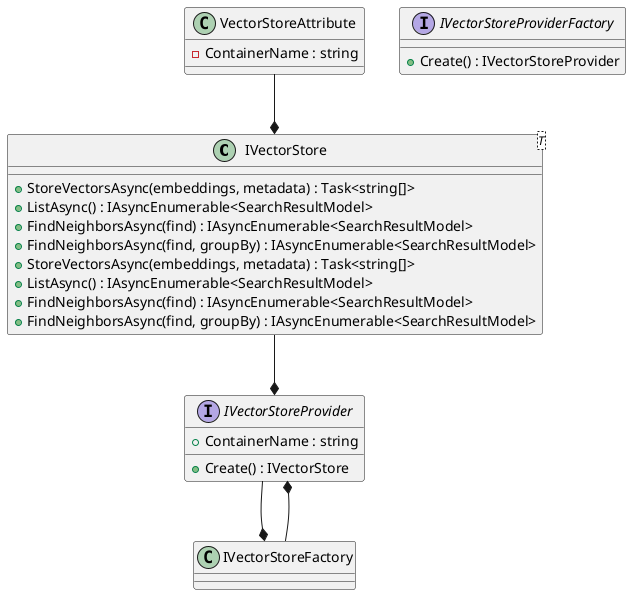

Here is the documentation for the source code:

# Eliassen.Search.Abstractions

Eliassen.Search.Abstractions provides interfaces and models for storing and querying vectors efficiently. Here's a breakdown of its key components:

## IVectorStore

Interface for storing and querying vectors.

### Methods

* `StoreVectorsAsync`: Stores embeddings and metadata.
* `ListAsync`: Lists stored vectors.
* `FindNeighborsAsync`: Finds neighbors of a specified vector.
* `FindNeighborsAsync`: Finds neighbors of a specified vector, grouped by a key.

## IVectorStore`1

Generic interface for storing and querying vectors.

## SearchResultModel

Represents a search result model containing information about a search result.

### Properties

* `Score`: The score of the search result.
* `ItemId`: The item's ID value.
* `MetaData`: The item's metadata.

## SearchTypes

Specifies types of search.

## IVectorStoreFactory

Interface for creating instances of IVectorStore.

### Methods

* `Create`: Creates a new instance of IVectorStore with the specified container name.
* `Create``1`: Creates a new instance of IVectorStore of the specified type.

## IVectorStoreProvider

Interface for a vector store provider that implements IVectorStore.

### Properties

* `ContainerName`: The name of the container.

### Methods

* `Create`: Creates a new instance of IVectorStoreProvider with the specified container name.

## IVectorStoreProviderFactory

Interface for creating instances of IVectorStoreProvider.

### Methods

* `Create`: Creates a new instance of IVectorStoreProvider with the specified container name.

## VectorStoreAttribute

Attribute for specifying the container name for a vector store.

### Properties

* `ContainerName`: The name of the container.

This attribute can be applied to a class that implements IVectorStore.



```plantuml
@startuml
sequenceDiagram
participant IVectorStore as "IS"
participant IVectorStoreProvider as "ISP"
participant IVectorStoreFactory as "ISPF"
participant SearchResultModel as "SRM"

note "Store Vector" as "1"
IS ->> ISP: StoreVectorsAsync(embeddings, metadata)
ISP ->> ISPF: Create
ISPF ->> IS: IVectorStore

note "List Vectors" as "2"
IS ->> ISP: ListAsync()
ISP ->> IS: IAsyncEnumerable<SearchResultModel>

note "Find Neighbors" as "3"
IS ->> ISP: FindNeighborsAsync(find)
ISP ->> IS: IAsyncEnumerable<SearchResultModel>

note "Find Neighbors (grouped)" as "4"
IS ->> ISP: FindNeighborsAsync(find, groupBy)
ISP ->> IS: IAsyncEnumerable<SearchResultModel>

@enduml
```

### Component Model

The Eliassen.Search.Abstractions assembly contains the following components:

* `IVectorStore`: The main interface for storing and querying vectors.
* `IVectorStore` generic: A generic version of `IVectorStore` for working with vectors of specific types.
* `SearchResultModel`: Represents a search result model containing information about a search result.
* `IVectorStoreFactory`: An interface for creating instances of `IVectorStore`.
* `IVectorStoreProvider`: An interface for a vector store provider that implements `IVectorStore`.
* `IVectorStoreProviderFactory`: An interface for creating instances of `IVectorStoreProvider`.
* `VectorStoreAttribute`: An attribute for specifying the container name for a vector store.

These components work together to provide a robust framework for vector storage and querying, facilitating efficient retrieval and manipulation of vector data.