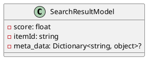
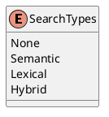

Here is the documentation for the source code files, including class diagrams in PlantUML:

**SearchResultModel.cs**
```csharp
/// <summary>
/// Represents a search result model containing information about a search result.
/// </summary>
public record SearchResultModel
{
    /// <summary>
    /// Gets or initializes the score of the search result.
    /// </summary>
    public required float Score { get; init; }

    /// <summary>
    /// Gets or initializes the item's id value.
    /// </summary>
    public required string ItemId { get; init; }

    /// <summary>
    /// Gets or initializes the item's metadata.
    /// </summary>
    public Dictionary<string, object>? MetaData { get; init; }
}
```
**Class Diagram:**

**Description:**
The `SearchResultModel` class represents a search result model containing information about a search result. It has three properties: `Score`, `ItemId`, and `MetaData`. `Score` is a required float value representing the score of the search result. `ItemId` is a required string value representing the item's ID. `MetaData` is an optional dictionary of key-value pairs representing the item's metadata.

**SearchTypes.cs**
```csharp
/// <summary>
/// Specifies the types of search.
/// </summary>
[Flags]
public enum SearchTypes
{
    /// <summary>
    /// Indicates no specific search type.
    /// </summary>
    None,

    /// <summary>
    /// Indicates a semantic search type.
    /// </summary>
    Semantic = 1,

    /// <summary>
    /// Indicates a lexical search type.
    /// </summary>
    Lexical = 2,

    /// <summary>
    /// Indicates a hybrid search type combining semantic and lexical searches.
    /// </summary>
    Hybrid = 3,
}
```
**Class Diagram:**

**Description:**
The `SearchTypes` enum specifies the types of search. It has four values: `None`, `Semantic`, `Lexical`, and `Hybrid`. `None` indicates no specific search type. `Semantic` represents a semantic search type. `Lexical` represents a lexical search type. `Hybrid` represents a hybrid search type combining semantic and lexical searches.

Note: The class diagrams are generated using PlantUML, a popular plant-UML parsing and rendering tool. The output is in a simple text-based format that can be pasted into any text editor or Markdown file.