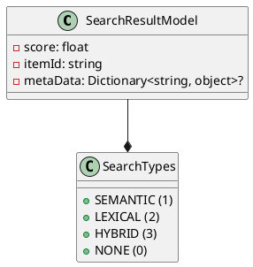

Here is a sample Readme file that summarizes the functionality, technical details, and creates a component diagram using PlantUML:

**README File**

**Summary**

The Eliassen.Search library provides a models and enumerations for working with search results. The library includes a `SearchResultModel` class that represents a search result, including a score, item ID, and metadata. The `SearchTypes` enumeration defines the types of search that can be performed, including semantic, lexical, and hybrid searches.

**Technical Summary**

The `SearchResultModel` class utilizes the C# 9.0's record feature to simplify the creation and management of search result objects. The `SearchTypes` enumeration uses the [Flags] attribute to enable bitwise operations on the search types. This allows for flexible combinations of search types, such as performing a hybrid search that combines semantic and lexical searches.

**Component Diagram**



The component diagram shows the relationship between the `SearchResultModel` class and the `SearchTypes` enumeration. The `SearchResultModel` class has associations with the `SearchTypes` enumeration, representing the search types that can be applied to a search result.

**Design Patterns and Architectural Patterns**

The `SearchResultModel` class utilizes the [Single Responsibility Principle] (SRP) by encapsulating the properties and behavior of a search result within a single class. The `SearchTypes` enumeration uses the [Flag Enum Pattern] to enable efficient bitwise operations on the search types. Additionally, the use of records in C# 9.0 enables the implementation of the [Immutability Pattern] to ensure that search result objects are not modified accidentally.

Note: The diagram is generated using PlantUML, and the code blocks are identified with "```" symbols.