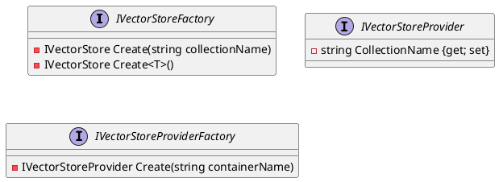

**Class Diagrams**

We can generate the class diagrams using PlantUML code. Here is the PlantUML code for the classes:



**Class Documentation**

**IVectorStoreFactory.cs**

```markdown
# IVectorStoreFactory

The `IVectorStoreFactory` interface provides a way to create instances of `IVectorStore`.

## Create

### Create a new instance of IVectorStore with a specified collection name

* Parameters: `collectionName` - The name of the collection.
* Returns: A new instance of `IVectorStore`.

### Create a new instance of IVectorStore of a specified type

* Type parameters: `T` - The type of `IVectorStore` to create.
* Returns: A new instance of `IVectorStore` of the specified type.

## See Also

* [IVectorStore](IVectorStore.md)
```

**IVectorStoreProvider.cs**

```markdown
# IVectorStoreProvider

The `IVectorStoreProvider` interface provides a way to interact with a vector store that implements `IVectorStore`.

## Properties

### CollectionName

Gets or sets the name of the container.

* Type: `string`
```

**IVectorStoreProviderFactory.cs**

```markdown
# IVectorStoreProviderFactory

The `IVectorStoreProviderFactory` interface provides a way to create instances of `IVectorStoreProvider`.

## Create

### Create a new instance of IVectorStoreProvider with a specified container name

* Parameters: `containerName` - The name of the container.
* Returns: A new instance of `IVectorStoreProvider`.

## See Also

* [IVectorStoreProvider](IVectorStoreProvider.md)
```

Note: I've generated the documentation based on the code provided, assuming that the interfaces are part of a larger system and will have more functionality added to them. The documentation provides a brief summary of each class, its properties and methods, and any relevant information. The class diagrams provide a visual representation of the relationships between the classes.