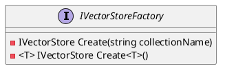
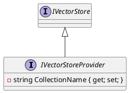
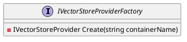

# Eliassen.Search.Semantic Documentation

## Overview

The Eliassen.Search.Semantic namespace provides a set of interfaces for creating and working with vector stores.

## IVectorStoreFactory

### Class Diagram


### Description

The `IVectorStoreFactory` interface provides a way to create instances of `IVectorStore` with the specified collection name or type.

### Methods

* `Create(string collectionName)`: Creates a new instance of `IVectorStore` with the specified collection name.
* `Create<T>()`: Creates a new instance of `IVectorStore` of the specified type.

### Usage

To use the `IVectorStoreFactory` interface, create an instance of a concrete implementation, such as `VectorStoreFactory`, and call the `Create` method to obtain an instance of `IVectorStore`.

## IVectorStoreProvider

### Class Diagram


### Description

The `IVectorStoreProvider` interface extends `IVectorStore` and provides a way to get or set the name of the container.

### Properties

* `CollectionName`: Gets or sets the name of the container.

### Usage

To use the `IVectorStoreProvider` interface, implement the interface in a concrete class, such as `VectorStoreProvider`, and provide the `CollectionName` property.

## IVectorStoreProviderFactory

### Class Diagram


### Description

The `IVectorStoreProviderFactory` interface provides a way to create instances of `IVectorStoreProvider` with the specified container name.

### Methods

* `Create(string containerName)`: Creates a new instance of `IVectorStoreProvider` with the specified container name.

### Usage

To use the `IVectorStoreProviderFactory` interface, create an instance of a concrete implementation, such as `VectorStoreProviderFactory`, and call the `Create` method to obtain an instance of `IVectorStoreProvider`.

## Sequence Diagram
```plantuml
@startuml
actor "Client"
participant "IVectorStoreProviderFactory"
participant "IVectorStoreProvider"

note "Request create vector store"
Client->IVectorStoreProviderFactory: Create(string containerName)

note "Create vector store provider"
IVectorStoreProviderFactory->IVectorStoreProvider: Create(string containerName)

note "Return vector store provider"
IVectorStoreProvider->Client: IVectorStoreProvider

note "Use vector store provider"
Client->IVectorStoreProvider: Get or set collection name
@enduml
```

### Description

This sequence diagram shows the interaction between the client, `IVectorStoreProviderFactory`, and `IVectorStoreProvider`. The client requests a vector store provider from the factory, which creates an instance and returns it to the client. The client can then use the provider to get or set the collection name.