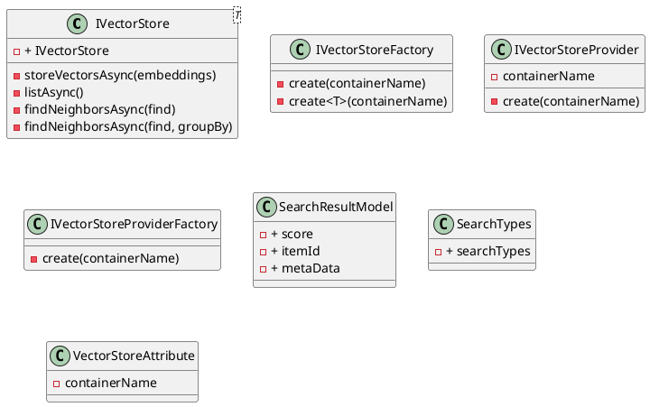

**README**

The Eliassen.Search.Abstractions project provides a set of interfaces and models for storing and querying vectors efficiently. It is designed to facilitate the development of scalable and fast vector search applications.

The primary interface, `IVectorStore`, provides methods for storing, listing, and finding neighbors of vector embeddings, along with metadata. The `IVectorStore<T>` generic interface is a specialization of the `IVectorStore` interface for a specific type `T`.

The `SearchResultModel` class represents a search result, containing information such as the score, item ID, and metadata. The `SearchTypes` class specifies the types of search operations. The `IVectorStoreFactory` and `IVectorStoreProviderFactory` interfaces provide methods for creating instances of `IVectorStore` and `IVectorStoreProvider` respectively.

The `VectorStoreAttribute` class can be applied to a class that implements `IVectorStore` to specify the container name for the vector store.

**Technical Summary**

The Eliassen.Search.Abstractions project uses the following design patterns and architectural patterns:

* Interface Segregation Principle (ISP): The project defines multiple interfaces (`IVectorStore`, `IVectorStore<T>`, `IVectorStoreFactory`, etc.) to separate concerns and provide flexibility.
* Dependency Injection: The project uses interfaces and factories to decouple the dependencies between components.
* Single Responsibility Principle (SRP): The project components have a single responsibility and are designed to perform a specific task.

**Component Diagram**

This component diagram shows the relationships between the various components in the Eliassen.Search.Abstractions project. The `IVectorStore` interface is the core interface for storing and querying vectors, while the `IVectorStore<T>` interface is a specialization for a specific type `T`. The `IVectorStoreFactory` and `IVectorStoreProviderFactory` interfaces provide methods for creating instances of `IVectorStore` and `IVectorStoreProvider` respectively. The `SearchResultModel` class represents a search result, and the `SearchTypes` class specifies the types of search operations. The `VectorStoreAttribute` class can be applied to a class that implements `IVectorStore` to specify the container name for the vector store.