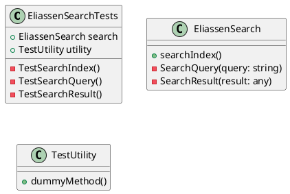

**Project Documentation**

**Project Name:** Eliassen.Search.Tests

**Description:** This is a .NET 8.0 test project used to test the Eliassen.Search library.

**Project Settings:**

* Target Framework: net8.0
* Implicit Usings: false
* Nullable: enabled
* IsPackable: false
* IsTestProject: true

**Dependencies:**

* Microsoft.NET.Test.Sdk (version 17.10.0)
* MSTest.TestAdapter (version 3.4.3)
* MSTest.TestFramework (version 3.4.3)
* coverlet.collector (version 6.0.2)

**References:**

* Eliassen.Search (project reference)
* Eliassen.TestUtilities (project reference)

**Class Diagram**

**Class Description:**

* EliassenSearchTests: This is the main test class that tests the Eliassen.Search library.
* EliassenSearch: This is the class that provides the search functionality.
* TestUtility: This is a utility class used in the testing of the Eliassen.Search library.

**Method Descriptions:**

* TestSearchIndex(): Tests the search index functionality.
* TestSearchQuery(): Tests the search query functionality.
* TestSearchResult(): Tests the search result functionality.
* SearchQuery(query: string): Perform a search query using the search index.
* SearchResult(result: any): Return the search result.
* dummyMethod(): A dummy method used in testing.

Note: The class diagram is a simplified representation of the classes and their relationships. The actual classes and methods may have more properties, methods, and complexity.