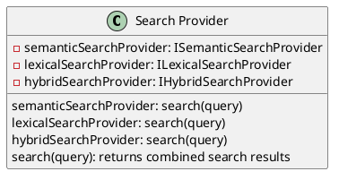
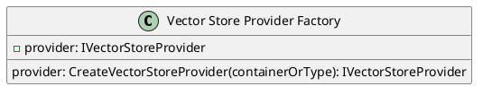
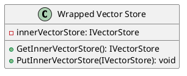

Here is the documentation for the source code:

# Eliassen.Search
================

## Overview
-----------

Eliassen.Search is a .NET library that provides various search-related functionalities, including summary generation, search providers, and vector store management.

## Document Summary Generation Provider
------------------------------------

The Document Summary Generation Provider is responsible for generating summaries for documents asynchronously. It uses a combination of lexical and semantic search techniques to extract relevant information from the documents.

### Component Diagram
```plantuml
@startuml
extend Component "Document Summary Generation Provider" as dsg
extend Component "Lexical Search" as lex
extend Component "Semantic Search" as sem

dsg --> lex
dsg --> sem
@enduml
```
## Hybrid Search Provider
-------------------------

The Hybrid Search Provider combines the results from lexical and semantic search providers to provide more accurate search results.

### Sequence Diagram
```plantuml
@startuml
actor "User" as user
extend Class "Hybrid Search Provider" as hybrid

user ->> hybrid: Search query
hybrid ->> lex: Search query
hybrid ->> sem: Search query
lex --> hybrid: Lexical search results
sem --> hybrid: Semantic search results
hybrid --> user: Hybrid search results
@enduml
```
## Search Provider
-----------------

The Search Provider combines semantic, lexical, and hybrid search approaches to provide comprehensive search results.

### Class Diagram

## Vector Store Factory
------------------------

The Vector Store Factory creates vector stores based on specified containers or types.

### Component Diagram
```plantuml
@startuml
extend Component "Vector Store Factory" as vsf
extend Component "Vector Store" as vs

vsf --+> vs
@enduml
```
## Vector Store Provider Factory
--------------------------------

The Vector Store Provider Factory creates vector store providers for dependency injection.

### Class Diagram

## Wrapped Vector Store
------------------------

The Wrapped Vector Store wraps another vector store to provide additional functionality.

### Class Diagram

## Service Collection Extensions
-----------------------------

The Service Collection Extensions class provides extension methods for configuring search-related services for dependency injection.

### Code
```csharp
using Eliassen.Search.Semantic;
using Microsoft.Extensions.DependencyInjection;
using Microsoft.Extensions.DependencyInjection.Extensions;

namespace Eliassen.Search
{
    public static class ServiceCollectionExtensions
    {
        public static IServiceCollection TryAddSearchServices(this IServiceCollection services)
        {
            services.TryAddTransient<IVectorStoreFactory, VectorStoreFactory>();
            services.TryAddTransient(typeof(IVectorStore<>), typeof(WrappedVectorStore<>));

            return services;
        }
    }
}
```
I hope this documentation helps to provide a clear understanding of the Eliassen.Search library!