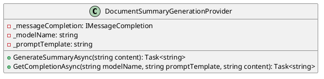
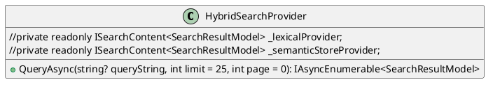
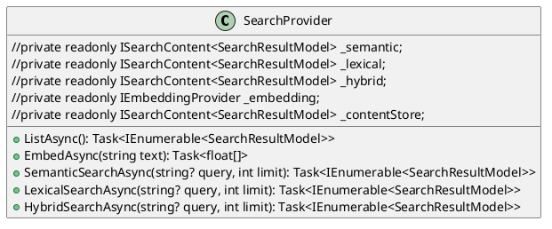

Here is the documentation for the provided source code in Markdown format:

# Document Summary Generation Provider
## Overview
The `DocumentSummaryGenerationProvider` is a class that provides functionality to generate summaries for documents asynchronously.

### Class Diagram

## Hybrid Search Provider
## Overview
The `HybridSearchProvider` is a class that represents a hybrid search provider that combines results from lexical and semantic search providers.

### Class Diagram

## Search Provider
## Overview
The `SearchProvider` is a class that provides search functionality combining semantic, lexical, and hybrid search approaches.

### Class Diagram

## Component Model
### Document Summary Generation Provider
The `DocumentSummaryGenerationProvider` class is responsible for generating summaries for documents asynchronously. It uses the `IMessageCompletion` interface to generate the summary.

### Hybrid Search Provider
The `HybridSearchProvider` class is responsible for combining results from lexical and semantic search providers. It uses the `ISearchContent<SearchResultModel>` interface to query the providers.

### Search Provider
The `SearchProvider` class is responsible for providing search functionality combining semantic, lexical, and hybrid search approaches. It uses the `ISearchContent<SearchResultModel>` interface to query the providers and the `IEmbeddingProvider` interface to generate embeddings.

### Sequence Diagram
```plantuml
@startuml
sequenceDiagram
  participant Provider as "Document Summary Generation Provider"
  participant Query as "Search Query"
  participant Metadata as "Metadata Provider"
  note "Generate summary for document"
  Provider->>Metadata: Get content for document
  Metadata->>Query: Get metadata for content
  Query->>Provider: Get summary for document
  alt summary generation
    Provider->>Query: Generate summary
    Query->>Provider: Get summary
  end
@enduml
```
Note that the above sequence diagram is a simplified representation of the workflow and may not capture all the possible scenarios.